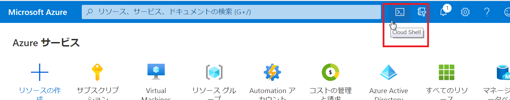
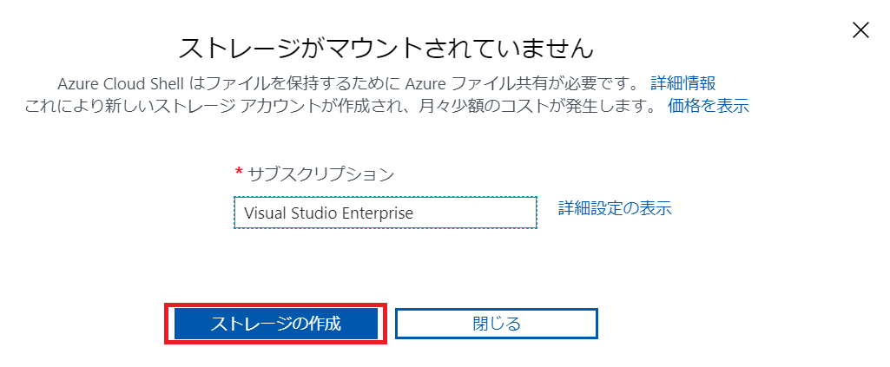
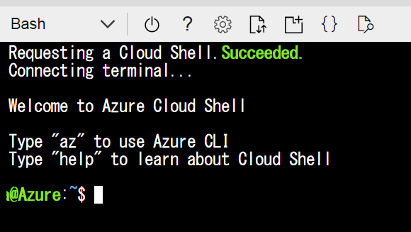

# 1.AROのセットアップ
## 環境の概要説明
ここでは基本的な ARO 環境のセットアップ方法、アクセス方法を説明します。<br>
なお、作成するクラスタに対しては、 API・コンテナともにインターネット上からアクセスできるように構築します。

## 環境準備（VNET作成等）

### 1.1. az aro 拡張機能の有効化とリソースプロバイダ登録
- Azure Portal から Cloud Shell （Bash）を開く
- az aro 拡張機能をインストールする
- Microsoft.RedHatOpenShift リソースプロバイダを登録する


まずは、Azure Portal から Cloud Shell （Bash）を開きます。



<br><br>
Cloud Shellにアクセスするのが初回の場合には、ストレージ作成の確認ダイアログが表示されますので、「ストレージの作成」をクリックします。


<br><br>
ログインが成功すると＄プロンプトが表示されます。



```bash

# サブスクリプションの確認
az account show
※表示されたサブスクリプション以外のものを指定したい場合は、次の「az account set」コマンドを実行して適切なサブスクリプション名を指定します。

# サブスクリプションの選択 ※ 自分のサブスクリプション名を指定します。
az account set -s 'サブスクリプション名'

# az aro拡張機能のインストール
az extension add -n aro --index https://az.aroapp.io/stable

# リソースプロバイダの登録
az provider register -n Microsoft.RedHatOpenShift --wait
```

### 1.2. Red Hat プルシークレット（認証キー）のダウンロード
- Red Hat 管理のコンテナレジストリからイメージを取得する際の認証キーを取得します
  - https://cloud.redhat.com/openshift/install/azure/aro-provisioned へRed Hat アカウントでログインし、プルシークレットファイル (pull-secret.txt) をCopyします
  - Red Hat アカウントがない場合はその場でも作成可能です （Email アドレスの登録およびTerms and Condition への承諾が必要）
  - 後でARO をインストールする時に利用するため、プルシークレットファイル (pull-secret.txt) をCloud Shell 環境で作成・保存しておきます
  - プルシークレットの適用は必須ではないが管理上利用を強く推奨します
  
  ```
  vi pull-secret.txt
  ※上でCopyしたプルシークレットをファイルとして作成し、保存します。
  ```

### 1.3. リソースグループ、VNET およびサブネットの作成
```bash
# パラメータの設定
echo "NAME_PREFIX=azrefarc${RANDOM}" > env
vi env
```

※以下の内容を追記します。
```
ARO_CLUSTER_NAME=${NAME_PREFIX}-aro
RG_ARO=${NAME_PREFIX}-aro-rg
LOCATION=japaneast
VNET_NAME=aro-vnet
MASTER_SUBNET_NAME=master-subnet
WORKER_SUBNET_NAME=worker-subnet
```
 ※ 一行目のNAME_PREFIXは他のユーザーと同じ名前にならないよう、Azure全体でユニークな名前を指定する必要があります。
 
 
 
```
source ./env
echo $NAME_PREFIX
```

```
# リソースグループの作成
az group create --name $RG_ARO --location $LOCATION

# VNETの作成
az network vnet create --resource-group $RG_ARO --name $VNET_NAME --address-prefixes 10.0.0.0/20

# Masterサブネットの作成
az network vnet subnet create --resource-group $RG_ARO --vnet-name $VNET_NAME \
  --name $MASTER_SUBNET_NAME --address-prefixes 10.0.0.0/23 --service-endpoints Microsoft.ContainerRegistry

# Workerサブネットの作成
az network vnet subnet create --resource-group $RG_ARO --vnet-name $VNET_NAME \
  --name $WORKER_SUBNET_NAME --address-prefixes 10.0.2.0/23 --service-endpoints Microsoft.ContainerRegistry

# Masterサブネットのプライベートエンドポイントポリシーの無効化
az network vnet subnet update --resource-group $RG_ARO --vnet-name $VNET_NAME \
  --name $MASTER_SUBNET_NAME --disable-private-link-service-network-policies true
```

## ARO作成コマンド実行

### 1.4. ARO の作成およびクラスタ接続情報の入手
- ARO を作成する(30-35分程度かかる)
- クラスタ初期管理者(kubeadmin)の資格情報を取得
- APIサーバURL (CLI ログイン用)、GUI ログイン用 URL を取得

```bash
# ARO クラスタの作成
$ az aro create --resource-group $RG_ARO --name $ARO_CLUSTER_NAME --vnet $VNET_NAME \
  --master-subnet $MASTER_SUBNET_NAME --worker-subnet $WORKER_SUBNET_NAME --pull-secret "$(< pull-secret.txt)"

※30分前後かかります。


# クラスタ管理者(kubeadmin)の資格情報の入手
$ az aro list-credentials --name $ARO_CLUSTER_NAME --resource-group $RG_ARO

※ここに表示される管理者（kubeadmin）のパスワードをメモします。

# API サーバ URL (CLIログイン用) を表示
$ az aro show --resource-group $RG_ARO --name $ARO_CLUSTER_NAME --query "apiserverProfile.url" -o tsv
https://api.0l87n0hz.japaneast.aroapp.io:6443/

※ここに表示されるCLIログイン用URLをメモします。


# Web Console URL（GUI ログイン用）を表示
$ az aro show --resource-group $RG_ARO --name $ARO_CLUSTER_NAME --query "consoleProfile.url" -o tsv
https://console-openshift-console.apps.0l87n0hz.japaneast.aroapp.io/

※ここに表示されるGUIログイン用URLをメモします。

```

### 1.5. oc (OpenShift CLI) およびブラウザ (GUI) による接続
- oc ツールのダウンロードとログイン
  - ツールを解凍することで oc バイナリ、kubectl バイナリが展開されるためPATHを設定
  - 一度 CLI ログインすると、~/.kube/config ファイルに認証情報ファイルが保存されます
- ブラウザ経由での GUI ログイン
  - GUIログイン用URLへアクセスし、ユーザ名:kubeadmin、パスワード：<kubeadminの資格情報>を入力してログインします

```bash
# ocツールのダウンロードと解凍
wget https://mirror.openshift.com/pub/openshift-v4/clients/ocp/latest/openshift-client-linux.tar.gz
tar zxf openshift-client-linux.tar.gz
export PATH=.:$PATH

# ocツールを用いたCLIログイン
oc login CLIログイン用URL -u kubeadmin –p パスワード 
```

## 初期環境設定（認証など）

### 1.6. 認証初期設定(htpasswd認証のセットアップ)
- 認証・認可設定

```
# パラメータの設定
vi env
```

```bash
※以下を追記
ARO_API_URL=CLIログイン用URL
```

```
source ./env
echo $NAME_PREFIX
```

```
# HTPasswd 認証用ファイルの作成（ユーザ・パスワード設定）
htpasswd -c -B -b users.htpasswd admin "p&ssw0rdp&ssw0rd" # cluster admin
htpasswd -B -b users.htpasswd admin01 "p&ssw0rdp&ssw0rd"  # tenant admin
htpasswd -B -b users.htpasswd user01 "p&ssw0rdp&ssw0rd"  # developer

# OpenShift 認証設定（HTPasswd ファイルの取り込み）
oc create secret generic htpass-secret --from-file=htpasswd=users.htpasswd -n openshift-config
cat <<EOF | oc apply -f -
apiVersion: config.openshift.io/v1
kind: OAuth
metadata:
  name: cluster
spec:
  identityProviders:
  - name: htpasswd_provider
    mappingMethod: claim
    type: HTPasswd
    htpasswd:
      fileData:
        name: htpass-secret
EOF

# "admin" ユーザをクラスタ管理者に指定
oc adm policy add-cluster-role-to-user cluster-admin admin --rolebinding-name=cust-cluster-admin

# "admin" ユーザで再ログイン ★以降の手順ではこの "admin" ユーザで操作を行います
oc login $ARO_API_URL --username=admin
oc get project

# クラスタ初期管理者(kubeadmin)の削除
# ★注意：直前の admin ユーザでログインできている（＝クラスタ管理者が kubeadmin 以外に存在する）状態で削除操作を行うこと。クラスタ管理者をすべて削除してしまった場合、クラスタを再作成する必要があるので注意。
oc delete secrets kubeadmin -n kube-system
```

## サンプルアプリのデプロイ

### 1.7. サンプルアプリのデプロイ
- プロジェクト（名前空間）の作成
- デプロイ用yamlファイルの作成
- リソースの展開

```bash
# 名前空間 (project) の作成
oc new-project sampleproj

# デプロイ用yamlファイルの作成
cat <<'EOF' > app.yaml
apiVersion: apps/v1
kind: Deployment
metadata:
  name: hellodep
  namespace: sampleproj
spec:
  replicas: 3
  selector:
    matchLabels:
      app: hello
  template:
    metadata:
      labels:
        app: hello
    spec:
      containers:
      - image: gcr.io/google-samples/node-hello:1.0
        name: hello
        ports:
        - containerPort: 8080
          protocol: TCP
---
apiVersion: v1
kind: Service
metadata:
  name: hellosvc
  namespace: sampleproj
spec:
  selector:
    app: hello
  ports:
  - protocol: TCP
    port: 8080
    targetPort: 8080
  type: LoadBalancer
EOF

# k8s への適用
oc apply --filename app.yaml

# 実行結果の確認
oc get pod --namespace sampleproj
oc get service --namespace sampleproj
```

### 1.8. デプロイしたリソースの確認
- ocコマンドによる確認

```bash
sodo@Azure:~$ oc get projects
NAME                                                    DISPLAY NAME   STATUS
default                                                                Active
kube-node-lease                                                        Active
kube-public                                                            Active
kube-system                                                            Active
…
sampleproj                                                             Active

sodo@Azure:~$ oc get service --namespace sampleproj
NAME       TYPE           CLUSTER-IP       EXTERNAL-IP    PORT(S)          AGE
hellosvc   LoadBalancer   172.30.218.103   20.44.175.40   8080:30756/TCP   8m31s

sodo@Azure:~$ oc get deploy --namespace sampleproj
NAME       READY   UP-TO-DATE   AVAILABLE   AGE
hellodep   3/3     3            3           8m57s

sodo@Azure:~$ oc get replicaset --namespace sampleproj
NAME                 DESIRED   CURRENT   READY   AGE
hellodep-c4644474f   3         3         3       9m24s

sodo@Azure:~$ oc get pod --namespace sampleproj
NAME                       READY   STATUS    RESTARTS   AGE
hellodep-c4644474f-252tm   1/1     Running   0          10m
hellodep-c4644474f-hlhcn   1/1     Running   0          10m
hellodep-c4644474f-t9ntx   1/1     Running   0          10m

sodo@Azure:~$ oc describe pod depweb-7797c9d88-djjnm --namespace sampleproj
Name:         hellodep-c4644474f-252tm
Namespace:    sampleproj
Priority:     0
Node:         azrefarc-aro-pv8lk-worker-japaneast1-fq54g/10.0.2.6
Start Time:   Sat, 25 Jul 2020 08:13:08 +0000
Labels:       app=hello
              pod-template-hash=c4644474f
...
```
