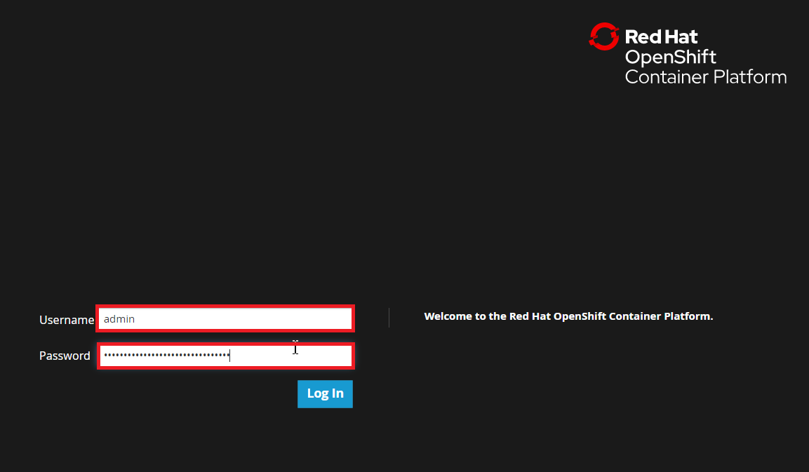
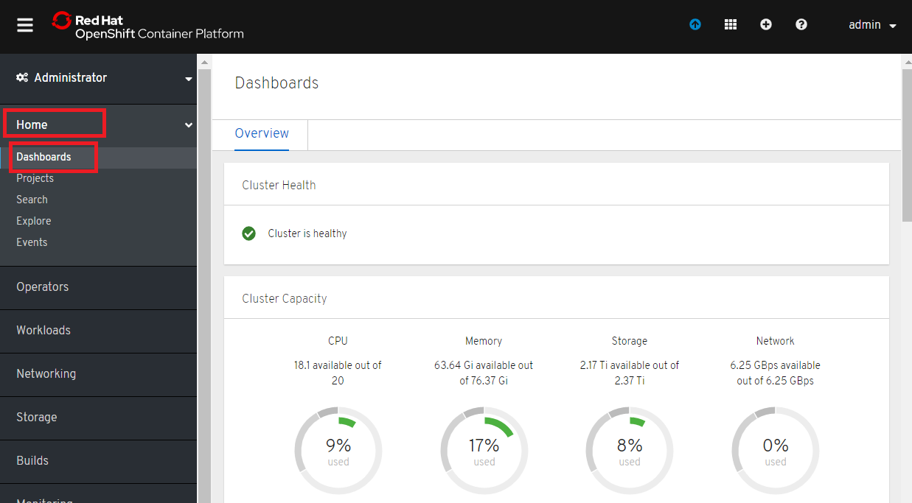
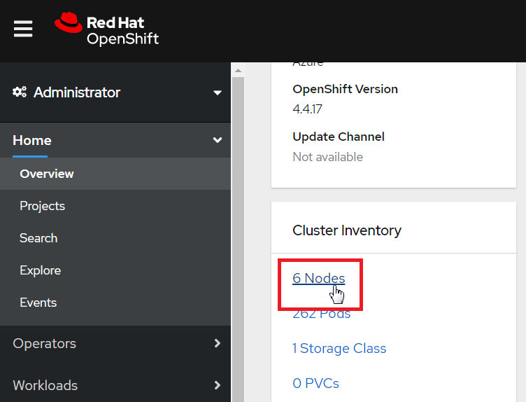
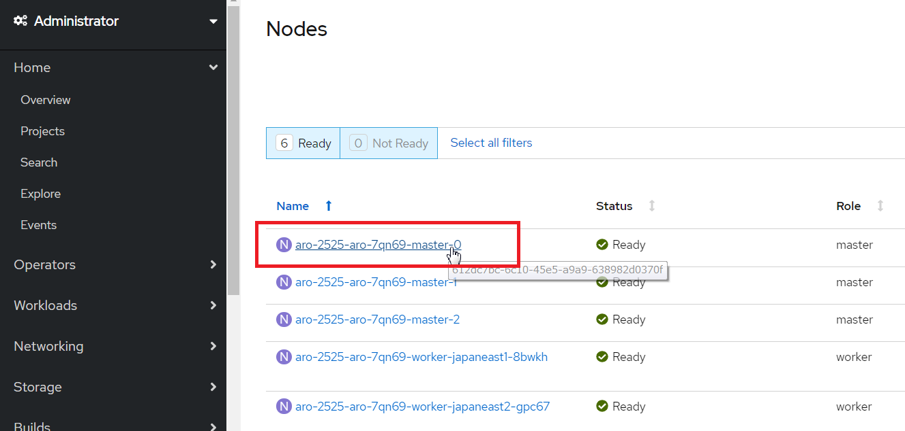
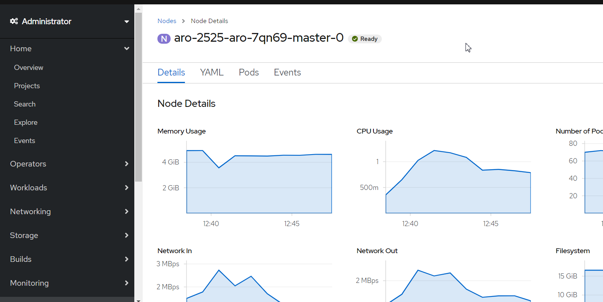
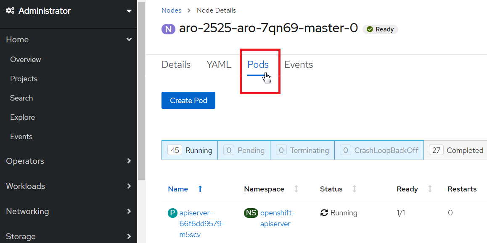
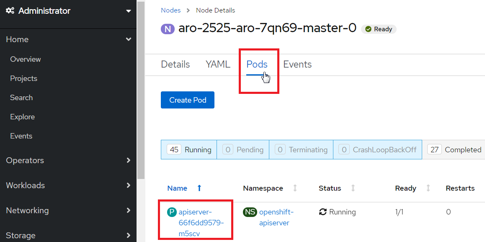
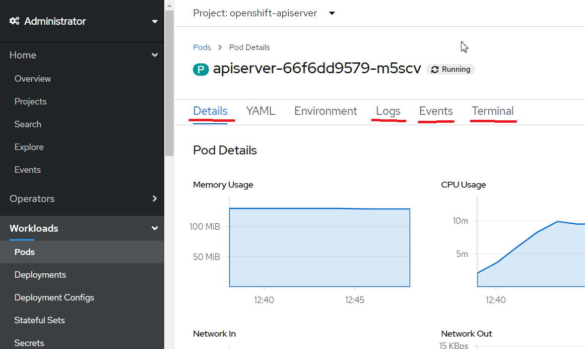

# 4.ARO環境へのログイン
## ARO環境へのログイン（CLI, GUI）

ログインする前にデフォルトの管理者ユーザー（kubeadmin）でログインするために必要となる資格情報を取得します。
```
# クラスタ管理者（kubeadmin）の資格情報の取得
az aro list-credentials --name $ARO_CLUSTER_NAME --resource-group $RG_ARO

# API サーバ URL（CLI ログイン用）の取得
az aro show -g $RG_ARO -n $ARO_CLUSTER_NAME --query apiserverProfile.url -o tsv

# Web Console URL（GUI ログイン用）の取得
az aro show -g $RG_ARO -n $ARO_CLUSTER_NAME --query consoleProfile.url -o tsv
```

az loginでAzureにログインします。
```
az login
```

oc loginでOpenShiftにログインします。上で取得した「kubeadminの資格情報」（apiserverProfile.url）を利用します。
```
ARO_API_URL=$(az aro show -g $RG_ARO -n $ARO_CLUSTER_NAME --query apiserverProfile.url -o tsv)
oc login $ARO_API_URL --username=kubeadmin
```

ログイン状態とノード状態を確認します。
```
# ログイン状態の確認
oc status
oc whoami

# ノード状態の確認
oc get node
```

新しい管理者ユーザーを作成し、デフォルトの管理者（kubeadmin）は削除します。
```
# HTPasswd 認証用ファイルの作成（ユーザ・パスワード設定）
htpasswd -c -B -b users.htpasswd admin "p&ssw0rdp&ssw0rd" # cluster admin
htpasswd -B -b users.htpasswd admin01 "p&ssw0rdp&ssw0rd"  # tenant admin
htpasswd -B -b users.htpasswd admin02 "p&ssw0rdp&ssw0rd"  # tenant admin
htpasswd -B -b users.htpasswd user01 "p&ssw0rdp&ssw0rd"  # developer
htpasswd -B -b users.htpasswd user02 "p&ssw0rdp&ssw0rd"  # developer

# OpenShift 認証設定（HTPasswd ファイルをOpenShiftの認証プロバイダーとして設定します）
oc create secret generic htpass-secret --from-file=htpasswd=users.htpasswd -n openshift-config
cat <<EOF | oc apply -f -
apiVersion: config.openshift.io/v1
kind: OAuth
metadata:
  name: cluster
spec:
  identityProviders:
  - name: htpasswd_provider
    mappingMethod: claim
    type: HTPasswd
    htpasswd:
      fileData:
        name: htpass-secret
EOF

# "admin" ユーザにクラスタ管理者のロールを付与します
oc adm policy add-cluster-role-to-user cluster-admin admin --rolebinding-name=cust-cluster-admin

# "admin" ユーザで再ログイン ★以降の手順ではこの "admin" ユーザで操作を行います
oc login $ARO_API_URL --username=admin
oc get project

# クラスタ初期管理者(kubeadmin)を削除します
# ★注意：直前の admin ユーザでログインできている（＝クラスタ管理者が kubeadmin 以外に存在する）状態で削除操作を行うこと。
oc delete secrets kubeadmin -n kube-system
```

## OpenShiftへのGUIログイン
まずは、OpenShift GUIコンソールのURLを確認します。
```
# GUIコンソールURLを確認
oc get route -n openshift-console
```

Webブラウザを起動して、OpenShift GUIコンソールのURLにアクセスします。<br>
https://console-openshift-console.<oc get routeで確認したURL>/<br>
　Username：admin<br>
　Password：p&ssw0rdp&ssw0rd<br>


## リソース利用状況の確認
「Home」→「Dashboard」をクリックし、OpenShiftクラスター全体のリソース使用率を確認します。
（CPU使用率、メモリ使用率、ストレージ、ネットワーク）



下の方にスクロールして、ノード数が「６」であることを確認し、クリックします。


`az aro create`コマンドをオプションなしで実行してOpenShiftクラスターを作成した場合のデフォルトのノード構成は、Masterノードが３台、Workerノードが３台の計６ノード構成であることが確認できます。

６ノードのうち、どれか１つのノードをクリックします。


このノードのリソース使用率を確認します。
（CPU使用率、メモリ使用率、ストレージ、ネットワーク）


「Pods」タブをクリックして、このノードで稼動しているPod・コンテナを確認します。


いずれか１つのPodをクリックして、各タブ、Yaml、Log、Event、Terminalをクリックして詳細を確認してみます。


