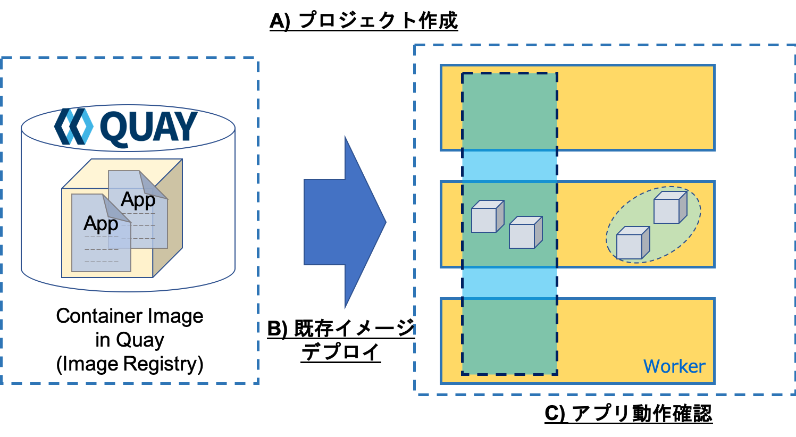
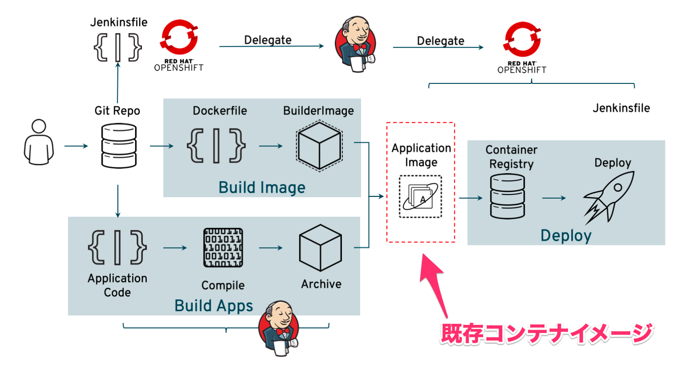
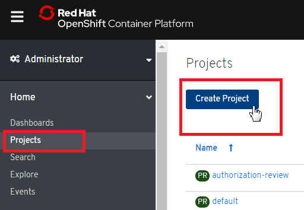
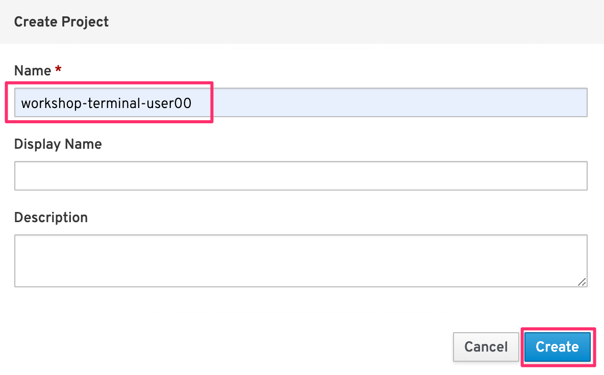
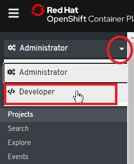
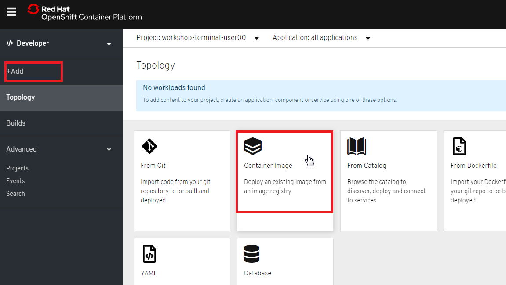
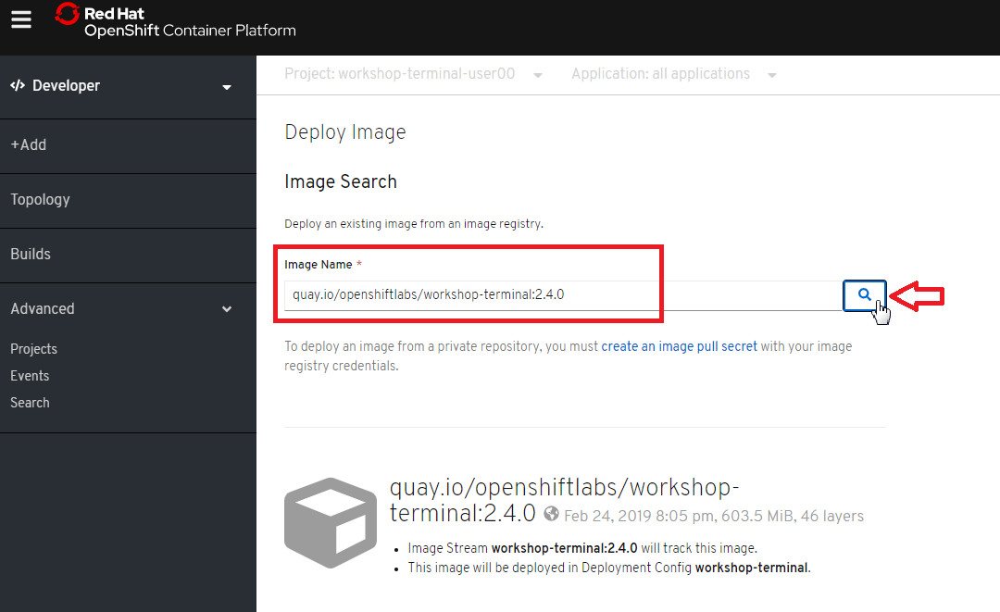
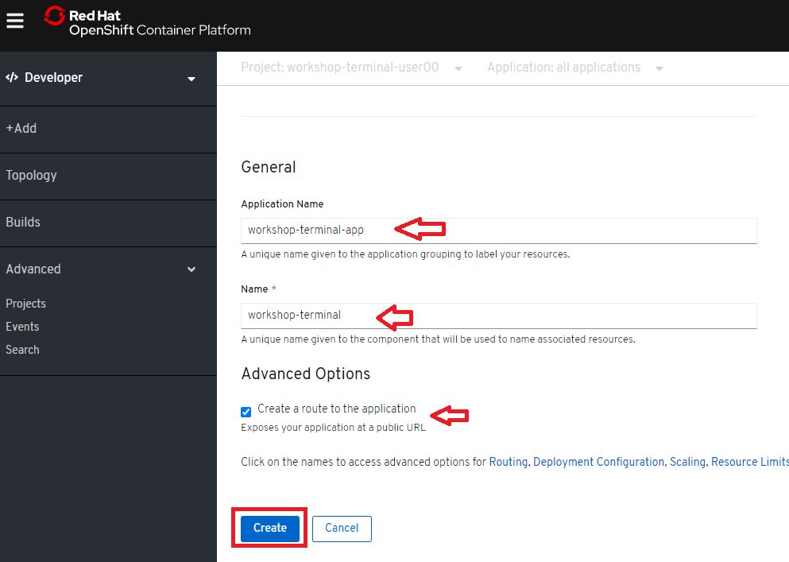
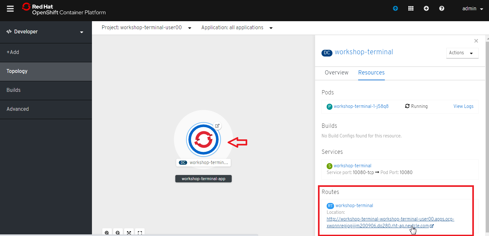
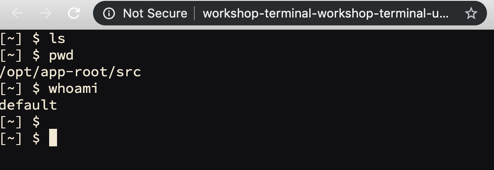

# 5.イメージデプロイとアクセス
## OpenShift4におけるデプロイについて
OpenShiftでは，いくつかの方法でアプリケーションをクラスター上にデプロイすることができます。

　① 既存のDockerイメージを使ってデプロイする方法

　② ソースコードとS2I(ツール)を使ってビルド&デプロイする方法

　③ ソースコードとDockerfileを使ってビルド&デプロイする方法

この章では、①の方法でデプロイする方法を説明します。

## 既存のコンテナイメージのデプロイ
ビルド済(アプリケーションコードとビルダーイメージ(S2I BuilderImage)が結合済)の既存コンテナイメージをOpenShift4クラスターにデプロイします。
- A) プロジェクトの作成
- B) 既存コンテナイメージのデプロイ
- C) アプリケーションの動作確認

### 既存コンテナイメージについて
ここでいう "既存コンテナイメージ" は以下の2つが結合済のイメージのことを指しています。  
- アプリケーションコード
- Builder Image
この手順では，**既にコンテナイメージ化済** のターミナルアプリケーションをOpenShift4上にデプロイする手順を実施します。

### OpenShift GUIコンソールへのログイン
**ブラウザを立ち上げて OpenShift GUIコンソール に接続し、ログインします。**

### A) プロジェクトの作成
OpenShift4コンソールで各自のプロジェクトを作成しましょう。  

1. [Home] > [Projects] > [Create Project] を選択します。  

    

1. プロジェクト名(例: `workshop-terminal-user00` )を指定し，**Create** を選択します。  
    
    プロジェクト名は任意です。  

    

### B) 既存コンテナイメージのデプロイ
1. **Developer** 画面に切り替えます。

    

2. **+Add** をクリックし、 **Container Image** を選択します。

    

3. **Image Name** を指定し、**検索ボタン** をクリックします。
    - Image Name: `quay.io/openshiftlabs/workshop-terminal:2.4.0`

    

4. Name(workshop-terminal)を確認して，**Create** をクリックします。

    

### C) アプリケーションの動作確認
1. 作成したアプリケーションをクリックし，Routesにある **Location欄のリンク** を開きます。

    
    

2. Terminalアプリが表示されることを確認します。

    

---
以上で，既存のコンテナイメージのデプロイは完了です。  

