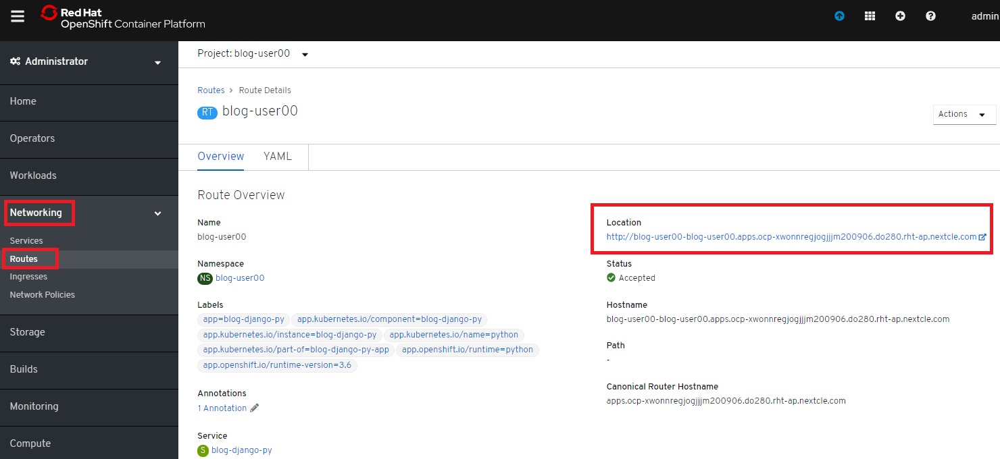

# 5.イメージデプロイとアクセス
## OpenShift4におけるデプロイについて
OpenShiftでは，いくつかの方法でアプリケーションをクラスター上にデプロイすることができます。

　① 既存のDockerイメージを使ってデプロイする方法

　② ソースコードとS2I(ツール)を使ってビルド&デプロイする方法

　③ ソースコードとDockerfileを使ってビルド&デプロイする方法

この章では、②の方法でデプロイする方法を説明します。

## 5-2.：② ソースコードとS2I(ツール)を使ってビルド&デプロイする
S2I(Source-to-Image)というツールを使って以下の2つのコンポーネントからコンテナイメージを生成し，コンテナアプリケーションをデプロイします。

- **リポジトリURL** : GitHubなどソースコード格納場所
- **S2I Builder Image** : S2Iスクリプトが含まれているDockerイメージ

またOpenShift4は，カタログ機能(Developer Catalog)を備えています。JavaやPython，nginxなどのS2I Builder Imageをカタログ上で選択，あるいはカタログ上に追加でき，アプリケーションを簡単にOpenShift4上にデプロイできます。

新規にプロジェクトを作成し，サンプルのコードとPython用のS2I Builder Imageを使ってコンテナイメージを作成し，アプリケーションをOpenShift4上にデプロイしてみましょう。

**ブラウザを立ち上げて OpenShift GUIコンソール に接続し、ログインします。**

まずは、新規にプロジェクトを作成しましょう。  
1. [Home] > [Projects] > [Create Project] を選択します。  
    

2. プロジェクト名(例: `blog-user00` )を指定し，**Create** を選択します。  
    プロジェクト名は任意です。  
    
    >Tips:
    >
    >OpenShift4ではプロジェクトを作成することで，新規Namespace(=プロジェクト名)が生成されます。NamespaceはK8sクラスターを論理的に分離させることが可能なK8sリソースの一種です。例えば，アプリA用のNamespaceを`ns_appa`，アプリB用のNamespaceを`ns_appb`のように作成することで，同一のK8sクラスター内に存在するns_appaとns_appbが干渉しないように構成することも可能です。

次に，サンプルのコードとPython用のS2I Builder Imageを使ってコンテナイメージを作成し，アプリケーションをOpenShift4上にデプロイします。
1. **Developer** 画面に切り替えます。

    

2. **+Add** をクリックし、[From Catalog] を選択します。

    

3. 検索窓に `Python` を入力し、[Python] をクリックします。

    

    >Tips:
    >
    >Developer CatalogからPythonアプリケーションを作成することで以下のリソースが作成されます。
    >- Build config
    >    - Gitリポジトリからソースコードをビルド
    >- Image stream
    >    - ビルド済イメージのトラッキング
    >- Deployment config    
    >    - イメージ変更の際に新リビジョンにロールアウト
    >- Service
    >    - クラスター内にワークロードを公開
    >- Route
    >    - クラスター外にワークロードを公開

3. アプリケーションのリポジトリなどを指定して，OpenShift4上にアプリケーションをデプロイします。

    最初に **[Create Application]**　をクリックします。  
    
    
    次に **[リポジトリなどいくつかの項目]** を指定し，最後に **[Create]** を選択します。  

    - Version: `python:3.6`
    - Git Repoaitory: `https://github.com/openshift-katacoda/blog-django-py` 
    - Create route: `(チェックを外した状態)`

    
    
    
    以上の手順で，blogアプリケーションをOpenShift4上にデプロイできました。  
    
    >Tips:
    >
    >TopologyからPodのアイコンをクリックすると、下図のように，デプロイ直後は "Build #1 is running" のように動作準備中（ビルド中）の状態です。  
    >
    >  
    >
    >少し待つと，下図のように **Pods** のステータスが "Running" となり正常に動作した状態を確認できます。  
    >
    >  
    >
#### blogアプリケーションの状態を確認
1.  [Pods]のリンクをクリックします。
    
    >Tips:  
    >
    >先と同じ手順でPodのリソース状況を確認したり，Logの確認などができます。  
    >
    >
    >
    >
    >さらに，Pod内のコンテナ内でコマンド実行も行えます。  
    >以下図のように [Terminal] を選択するとブラウザ上でターミナル内操作が行なえます。  
    >
    >
    >
    >Pod内に複数コンテナが存在する場合はプルダウンメニューで選択するだけでコンテナを切替えてターミナル操作が可能です。問題判別を行う際には，手間を省いてくれる意外と嬉しい機能です。

#### 外部からアクセスするための Route を作成
現在のblogアプリケーションは，OpenShift4クラスター内に閉じた状態ですので，外部からアクセスできるように Router を作成しましょう。  

1. **Administrator** 画面に切り替えます。

    

2. [Networking] > [Routes] > [Create Route] を選択します。

    

3. Routeの名前 **Name**，対象アプリ用の**Service**，**Port** を指定します。
    - Name: `任意の名前 (例: blog-user00)`
    - Service: `指定済のアプリ名 (例: blog-user00`
    - Target Port: `8080 → 8080(TCP)`
    
    
    
    >Tips:
    >
    >この手順ではServiceを「明示的には」作成していません。  
    >前の手順 で，Pythonテンプレートでblogアプリケーションをデプロイした際に，Podだけでなく，"Service" も同時に作成されています。
    >その際，Service名はアプリ名と同じ名前が指定されています。
    >
    >Developer Catalogで選択したテンプレートは，Kubernetes上でアプリを動作させるために必ず必要になるリソース(PodやServiceなど)や，便利にアプリケーションを管理できるようにするための仕組みを一挙に作成できるように用意されています。
    >
    
3. 最後に **Create** を選択します。

#### アプリケーションの動作確認
1. [Networking] > [Routes] を選択し，blog用のRouter(例: `blog-user00`)行にある **Location欄のリンク** を開きます。
    
    
    

2. blogアプリのサンプルページに自身のPod名が表示されていることを確認します。

    
    
    Pod名が分からない場合は，[Workloads] > [Pods] のPod一覧から確認しましょう。  
    
    
