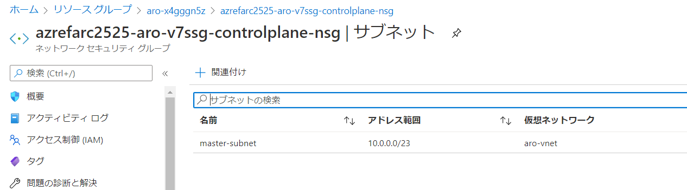

# 6.Azure環境の確認

この章では、`az aro create` コマンドで作成したOpenShiftクラスターの構成を、Azureポータル画面から確認してみます。

以下のコンポーネントをそれぞれ確認します。
 - Azure リソースグループと、OpenShiftクラスターのノード構成
 - Azure ネットワーク構成
 - Azure Active Directory
 
## Azure リソースグループと、OpenShiftクラスターのノード構成
Azureポータルにログインして、作成したOpenShiftクラスタを確認します。

まずは、２つのリソースグループが作成されていることを確認します。

|  No  |  リソースグループ名  |　説明|
| ---- | ---- | ---- |
|  １  |  ${NAME_PREFIX}-aro-rg  |　手動で作成したリソースグループ |
| ２ | aro-xxxxx | 自動的に作成されたARO用リソースグループ |

それぞれの２つのリソースグループにどのようなリソースが作成されているかを確認してください。

VM、ネットワーク、ストレージなどの実体は、「2.aro-xxxxx」の方に作成されていることが分かります。

 

各々のリソースグループをクリックして中に作成されたリソースの詳細を確認してみます。

リソースグループ「aro-xxxxx」の中に、６個のVMが作成されていることを確認します。

  
## Azure ネットワーク構成
リソースグループ「2.aro-xxxxx」の中の、セキュリティグループをクリックして詳細を確認し、作成したネットワークの構成を確認します。

Masterノード（controlplane）の３台と、Workerノード（node）の３台で異なるセキュリティグループにサブネットが接続されていることが分かります。

 

以下は、Workerノード（node）の３台が所属するセキュリティグループです。

 

以下は、Masterノード（controlplane）の３台が所属するセキュリティグループです。

  

## Azure Active Directory

次にAzure Active Directoryを確認します。

 

「アプリの登録」⇒「ディレクトリ内のすべてのアプリケーションを表示」をクリックします。

 

ARO（OpenShiftクラスター）を作成すると、アプリケーションとしてリソースグループ「aro-xxxx」が登録されていることが分かります。

 

所有者を追加するなど、Azure Active Directoryの機能と連携した様々な認証連携機能を使うことができます。

  
