# 7.運用管理機能の概要
- OpenShift Cluster Logging
  - ARO クラスタバージョンの確認
  - 依存 Operator の展開 (Elasticsearch Operator)
  - Cluster Logging Operatorの展開
  - Cluster Logging のインスタンスの展開
  - Kibana コンソールへのアクセス
- OpenShift Cluster Monitoring
  - Cluster Monitoring 初期設定の変更
  - Web Console (Monitoring メニュー）へのアクセス

### 7-1. Deploy OpenShift Cluster Logging
OpenShift Cluster Logging は、EFK スタック（Elasticsearch/Fluentd/Kibana）を用いたクラスタログ管理機能であり、OpenShift 管理コンソールから Operator を導入、設定することですぐに利用できる。ここでは、Operator の導入、設定手順、および、設定完了後の Kibana コンソールへのログイン方法までを示す。

#### ARO クラスタバージョンの確認
- Web Console へログイン

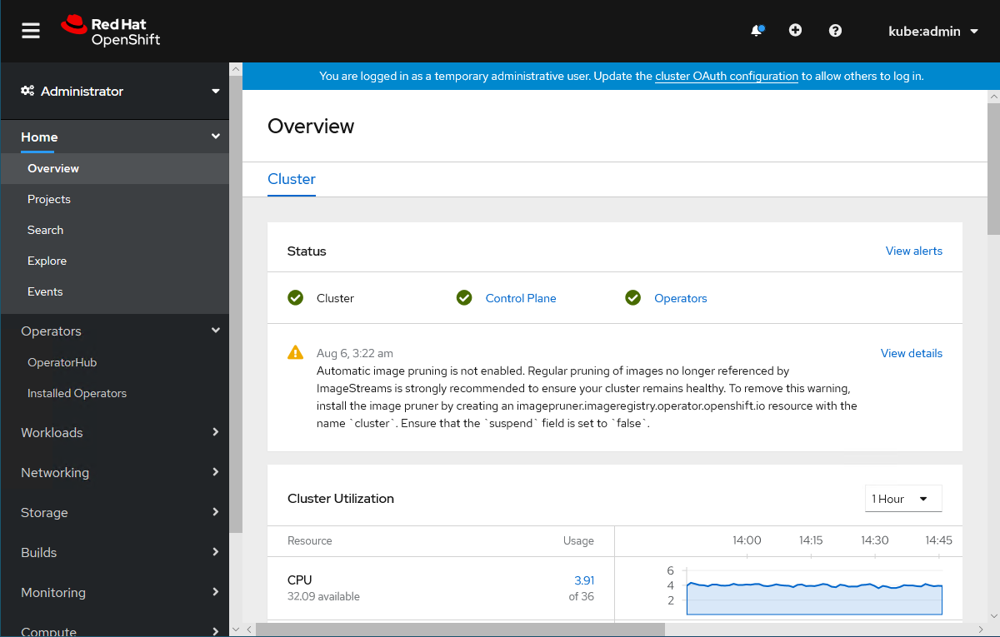

- [Administration] 以下の [Cluster Settings] をクリックして、マイナーバージョンを確認（Last Completed Version）
  - この例では "4.4.17" と表示されており、マイナーバージョンは "4.4" となる

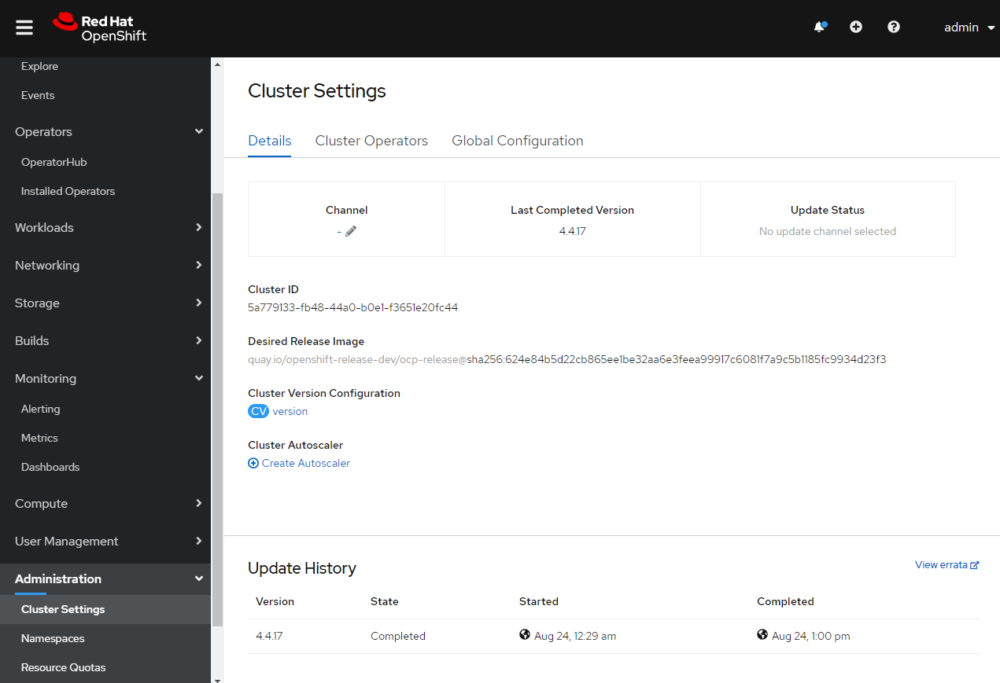

#### 依存 Operator の展開 (Elasticsearch Operator)
- Elasticsearch Operatorの展開
  - [Operators] メニューを開き、[OperatorHub] をクリック


- OperatorHub 一覧画面で検索欄に [Elasticsearch] を入力して検索し、[Elasticsearch Operator] が表示されたらクリック

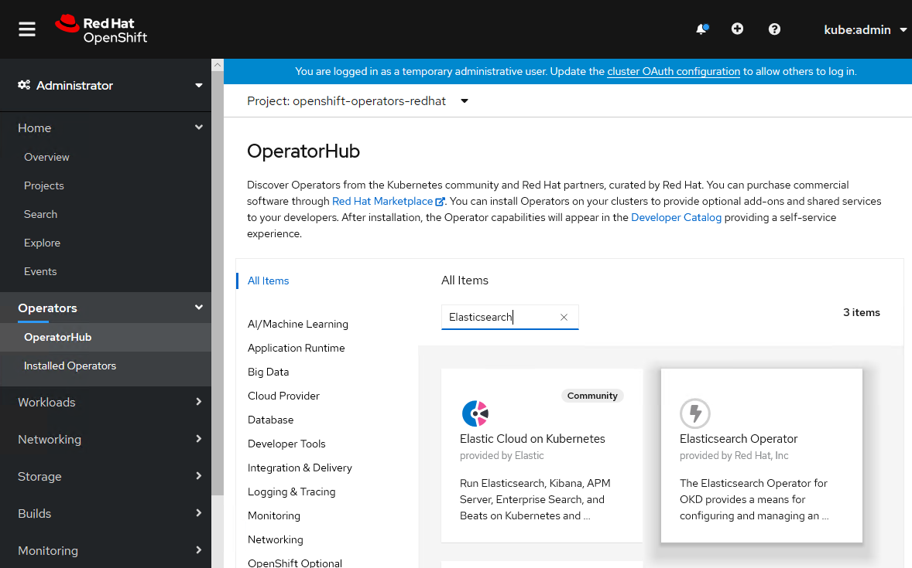

- [Install] をクリック

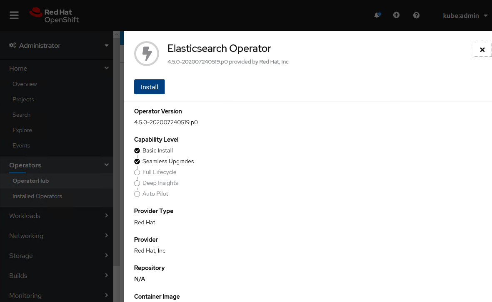

- Operator Subscription の設定
  - [Installation Mode] は "All namespaces on the cluster (default)" であることを確認
  - [Installed Namespace] は "openshift-operators-redhat (Operator recommended)" であることを確認
  - [Enable operator recommended cluster monitoring on this namespace] チェックボックスを選択
  - [Update Channel] では最初に確認したマイナーバージョンを選択（この例では 4.4 を選択）
  - [Approval Strategy] は "Automatic" であることを確認
  - [Subscribe] をクリック

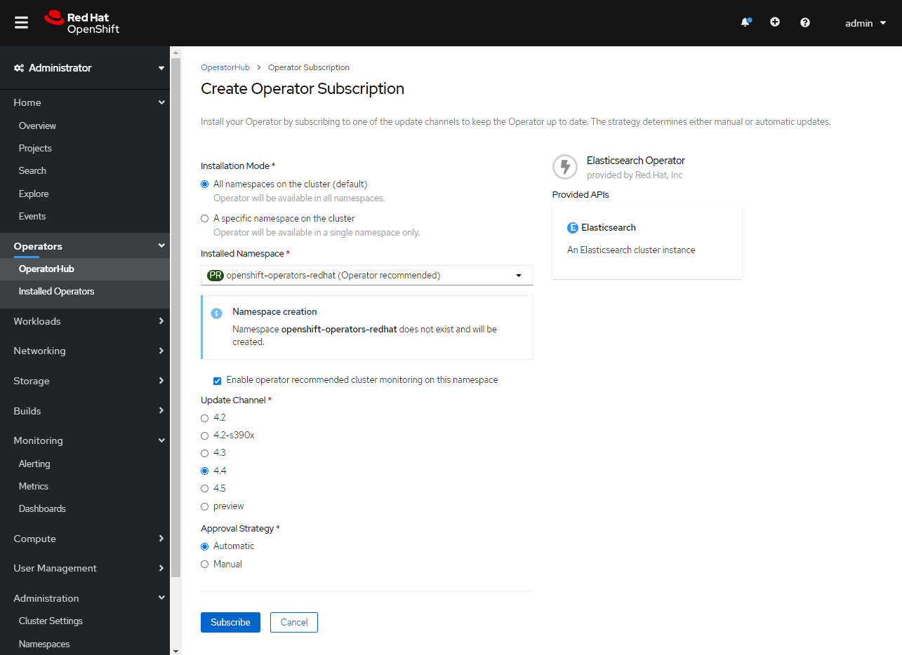

- [Status] が Installing となるので、完了まで待つ

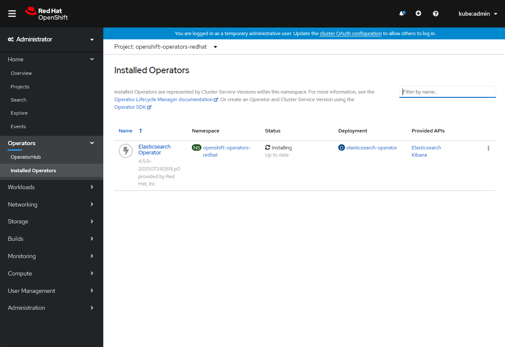

- [Status] が "Succeeded" となればElasticsearch Operatorの展開が完了する

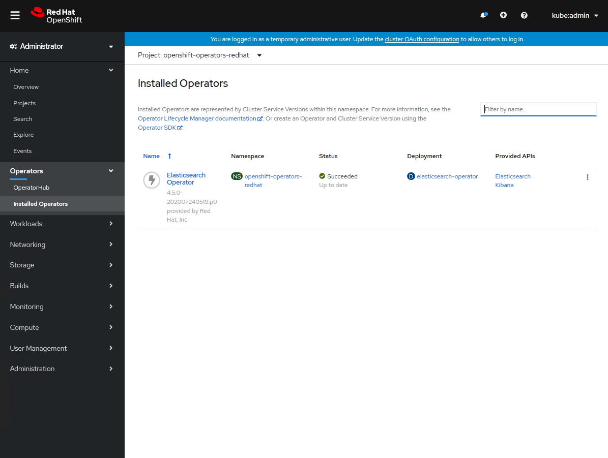

#### Cluster Logging Operatorの展開

- Cluster Logging Operatorの展開
  - [Operators] メニューを開き、[OperatorHub] をクリック

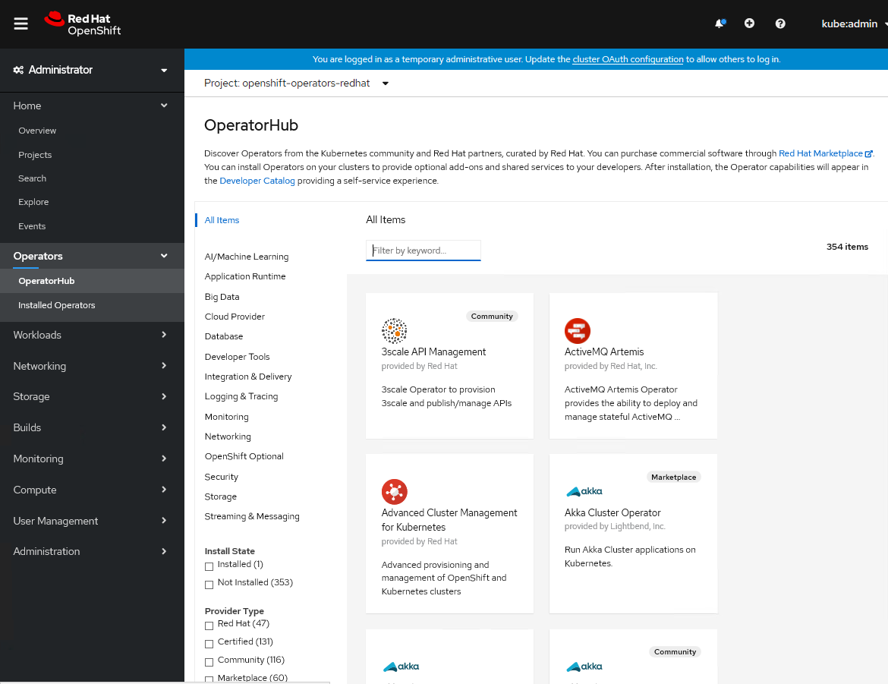

- OperatorHub 一覧画面で検索欄に [logging] と入力して検索し、[Cluster Logging Operator] が表示されたらクリック

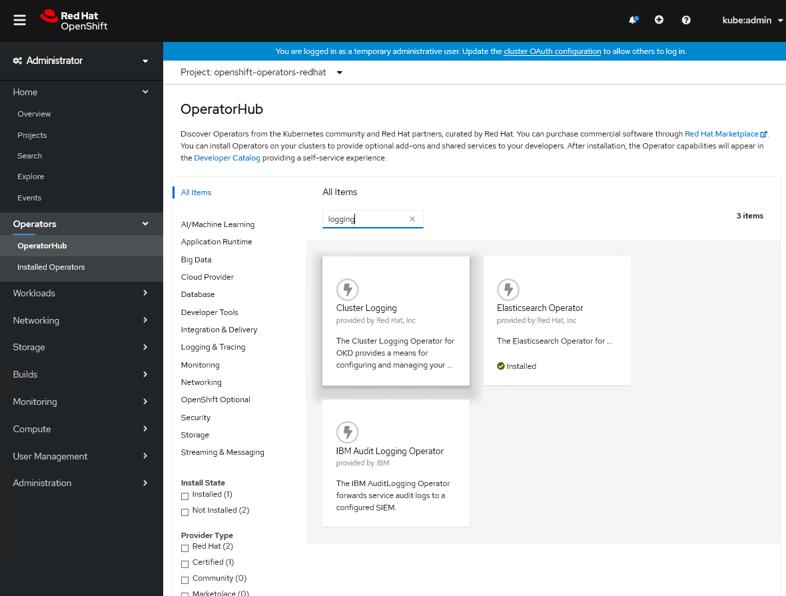

- [Install] をクリック

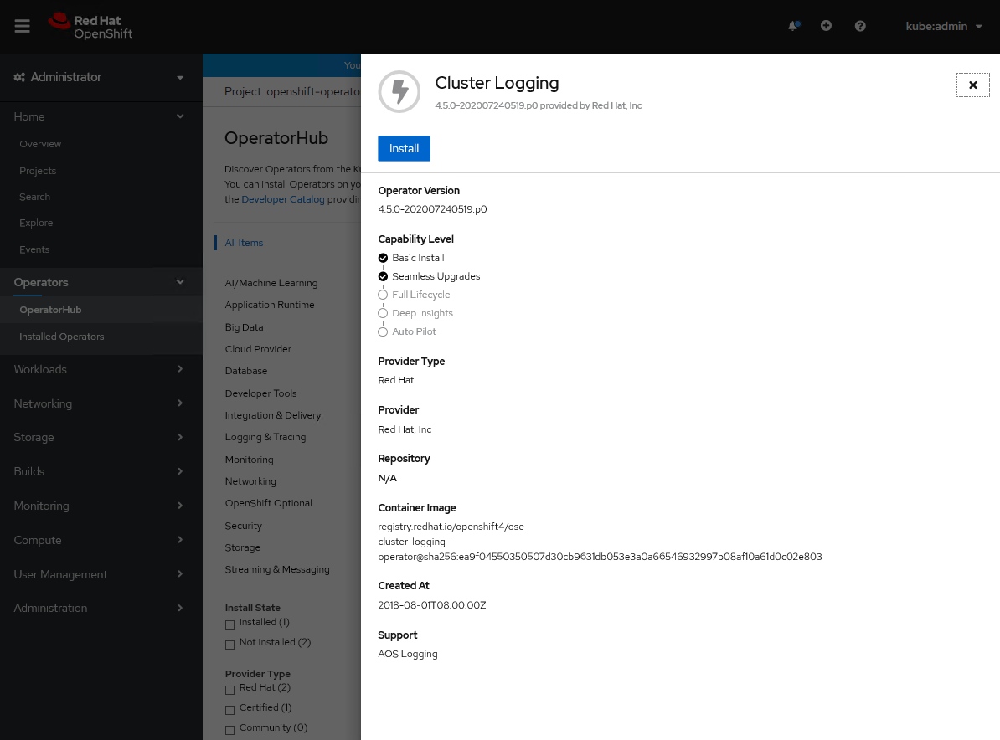

- Operator Subscrption の設定
  - [Installation Mode] は "All namespaces on the cluster (default)" であることを確認
  - [Installed Namespace] は "openshift-logging (Operator recommended)" であることを確認
  - [Enable operator recommended cluster monitoring on this namespace] チェックボックスを選択
  - [Update Channel] では最初に確認したマイナーバージョンを選択（この例では 4.4 を選択）
  - [Approval Strategy] は "Automatic" であることを確認
  - [Subscribe] をクリック

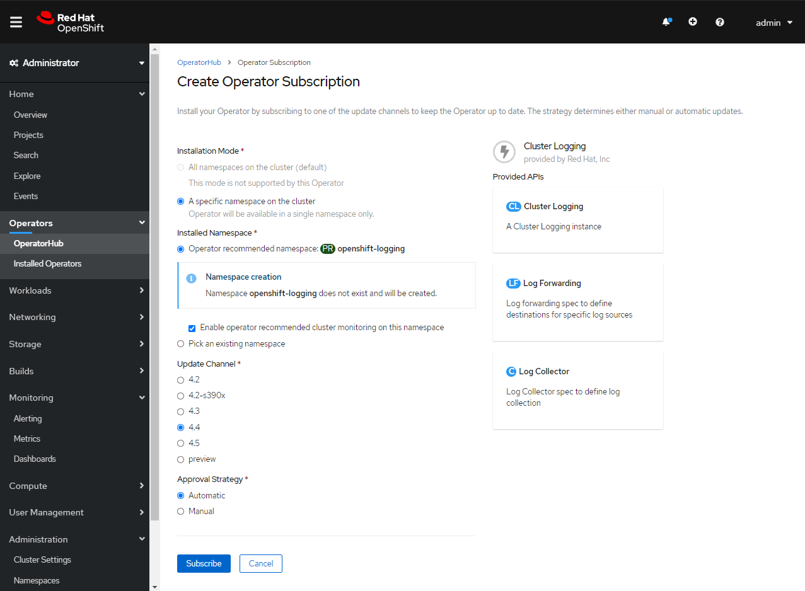

- [Status] が Installing となるので、完了まで待つ


- [Status] が "Succeeded" となれば Cluster Logging Operatorの展開が完了する

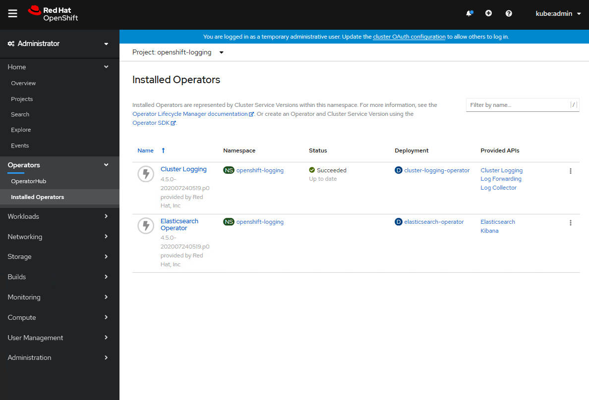


#### Cluster Logging のインスタンスの展開

- [Admininstration] メニューを開き、[Custom Resource Definitinos] をクリック


- Custom Resource Definition 一覧画面の検索欄で [logging] と入力し、[Cluster Logging] が表示されたらリンクをクリック

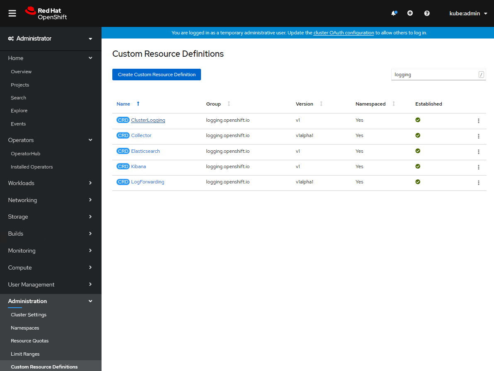

- Custom Resource Definition 詳細画面の右上にある [Action] プルダウンメニューから [View Instances] を選択

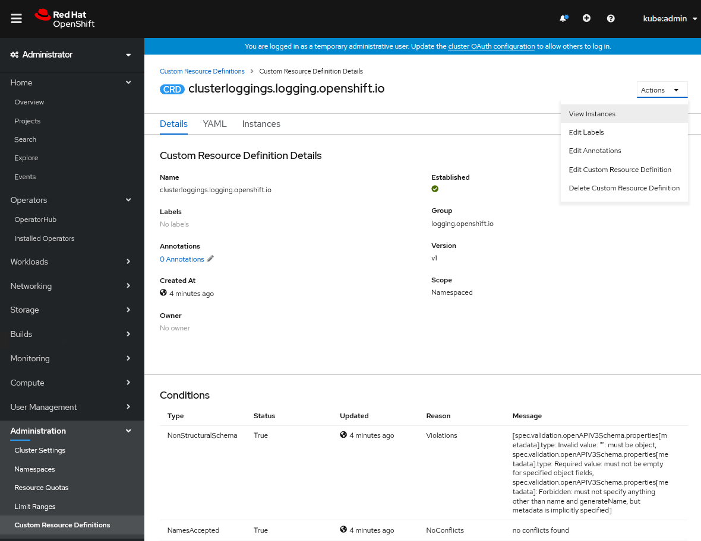

- [Create Cluster Logging] をクリック


- 新規作成する ClusterLogging Custom Resource の yaml 編集画面で、以下の yaml フォーマットテキストをすべて上書きで入力し、[Create] をクリック
- （注意１）Elasticsearch インスタンスに割り当てるメモリサイズについて
  - ARO クラスタ作成時の Worker ノードのインスタンスタイプに応じて、下記 ".spec.logStore.elasticsearch.resources" のメモリサイズを適宜変更すること
  - OpenShift4 では、実稼働環境に展開する場合は limits および requests ともにメモリサイズを 16Gi とすることが推奨されており、各 Elasticsearch のノードでは一般的にこの２倍のメモリを搭載することが望ましい
  - ARO の既定では、Worker ノードのサイズは D4s_v3（4Core/16Gmemory）のため、上記を考慮して適宜 Worker ノードのサイズを検討すること
  - （参考）https://access.redhat.com/documentation/ja-jp/openshift_container_platform/4.4/html-single/logging/index#cluster-logging-deploy-console_cluster-logging-deploying
  - （参考）https://access.redhat.com/documentation/ja-jp/openshift_container_platform/4.4/html/logging/configuring-your-cluster-logging-deployment
- （注意２）Elasticsearch インスタンスに割り当てる永続ストレージ(PV)について
  - 既定では Elasticsearch インスタンスのストレージは永続ストレージに保管されないため、実稼働環境においては下記例のように storageClassName を環境に合わせた値に設定することが望ましい
  - ARO では、既定で Managed Disk を PV のストレージクラスとして利用できるため、これを指定すると管理が容易となる

```yaml
apiVersion: "logging.openshift.io/v1"
kind: "ClusterLogging"
metadata:
  name: "instance"
  namespace: openshift-logging
spec:
  managementState: "Managed"
  logStore:
    type: "elasticsearch"
    elasticsearch:
      nodeCount: 3
      resources:
        limits:
          memory: 16Gi
        requests:
          cpu: 1
          memory: 16Gi
      storage:
        storageClassName: "managed-premium"
        size: "200G"
      redundancyPolicy: "SingleRedundancy"
  visualization:
    type: "kibana"
    kibana:
      replicas: 1
  curation:
    type: "curator"
    curator:
      schedule: "30 3 * * *"
  collection:
    logs:
      type: "fluentd"
      fluentd: {}
```

#### Kibana コンソールへのアクセス
- 展開が完了後、ブラウザを再読み込みして、左メニューの [Monitoring] 配下に新たに表示される [Logging] をクリック

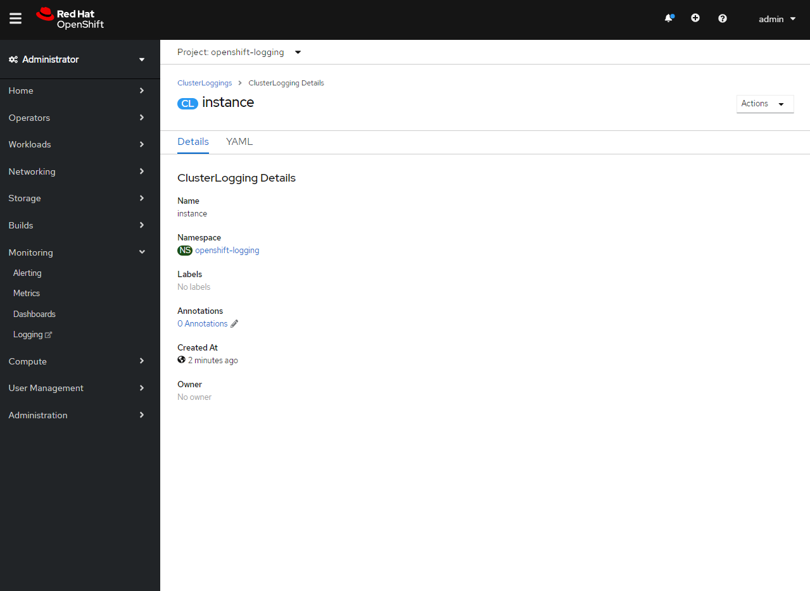

- [Login with OpenShift] をクリック

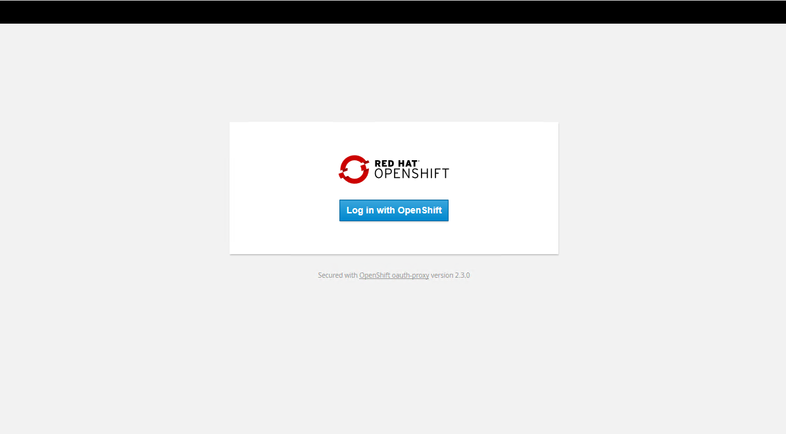

- OpenShift コンソールへログインするユーザ名、パスワードを入力して [Login] をクリック

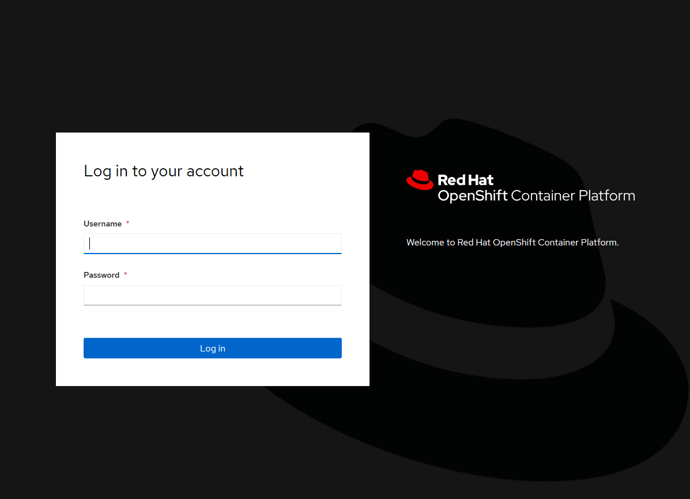

- [Allow Selected Permissions] をクリック

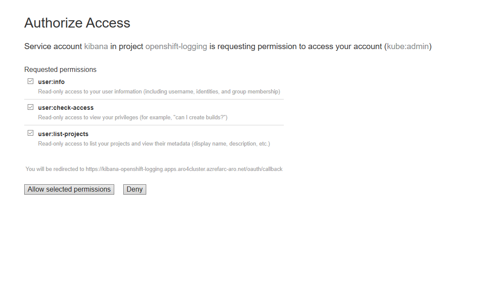

- Kibana の取得ログ一覧画面が表示される
  - 検索ウインドウからログメッセージで絞込みを行ったり、[Visualize],[Dashboard] 機能で可視化を行うなどの管理が行える

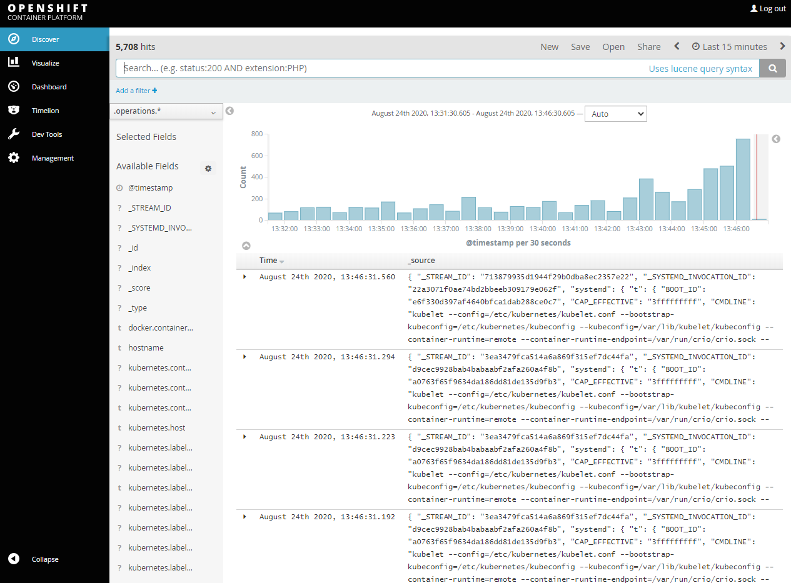


### 7-2. Deploy OpenShift Cluster Monitoring
OpenShift Cluster Monitoring は、Prometheus/Grafana を用いたクラスタモニタリング（監視）機能であり、OpenShift クラスタ作成後すぐに利用できる。収集される監視メトリクスは Grafana の GUI または Web Console から確認できる。ここでは、各ツールでの監視メトリクス確認手順を示す。

#### Cluster Monitoring 初期設定の変更
- Cluster Monitoring で稼働する Prometheus, Alertmanager インスタンスに割り当てる永続ストレージ(PV)について
  - 既定では Promethues, Alertmanager インスタンスのストレージは永続ストレージに保管されないため、実稼働環境においては下記例のように storageClassName を環境に合わせた値に設定することが望ましい
  - ARO では、既定で Managed Disk を PV のストレージクラスとして利用できるため、これを指定すると管理が容易となる
  - 以下の例では、クラスタ管理者が保守端末の oc CLI で設定変更を行う例を示す

```bash
# "admin" ユーザで再ログイン
ARO_API_URL=$(az aro show -g $RG_ARO -n $ARO_CLUSTER_NAME --query apiserverProfile.url -o tsv)
oc login $ARO_API_URL --username=admin
oc get project
cat <<EOF | oc apply -f -
apiVersion: v1
kind: ConfigMap
metadata:
  name: cluster-monitoring-config
  namespace: openshift-monitoring
data:
  config.yaml: |
    prometheusOperator: {}
    prometheusK8s:
      volumeClaimTemplate:
        metadata:
          name: prometheus
        spec:
          storageClassName: managed-premium
          resources:
            requests:
              storage: 200Gi
      retention: 14d
    alertmanagerMain:
      volumeClaimTemplate:
        metadata:
          name: alertmanager
        spec:
          storageClassName: managed-premium
          resources:
            requests:
              storage: 200Gi
    kubeStateMetrics: {}
    grafana: {}
    telemeterClient: {}
    k8sPrometheusAdapter: {}
    openshiftStateMetrics: {}
EOF
```

#### Web Console (Monitoring メニュー）へのアクセス
- Web Console の [Monitoring] 以下の [Dashboards] をクリック
- 既定で複数種類のダッシュボードが構成されており、左上の [Dashboard] メニューから選択して画面参照できる
  - [Kubernetes/Computer Resources/Cluster] 画面：クラスタ全体での CPU/メモリリソースの使用量が Namespace 単位で確認できる
  - [Kubernetes/Computer Resources/Node(Pods)] 画面：各ノードでの CPU/メモリリソースの使用量が Pod 単位で確認できる
  - [Kubernetes/Computer Resources/Namespace(Pods)] 画面：各 Namespace での CPU/メモリリソースの使用量が Pod 単位で確認できる
  - [Kubernetes/Computer Resources/Namespace(Workload)] 画面：各 Namespace での CPU/メモリリソースの使用量が Workload(deployment) 単位で確認できる
  - [Kubernetes/Networking/Cluster] 画面：クラスタ全体でのネットワーク帯域幅の使用量が Namespace 単位で確認できる
  - [USE Method/Node] 画面：各ノードでの USE メソッド（使用率、飽和状態、エラー）に基づくリソース状況が確認できる
  - [USE Method/Cluster] 画面：クラスタ全体での USE メソッド（使用率、飽和状態、エラー）に基づくリソース状況が確認できる

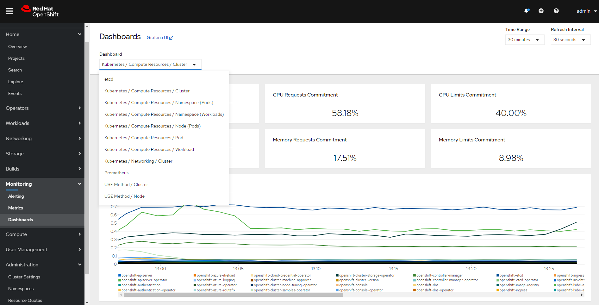

