# 9.CI／CDパイプラインの実践
ここではAROクラスタ上にアプリケーションを配置するが、閉域NW環境や、開発・運用分離を意識した環境構成を行う。
- アプリケーションを開発する環境は保守環境内とし、環境内でソースコード管理を行うためにGogsというgo言語で実装された軽量gitリポジトリを展開して利用する。またこのリポジトリには、アプリケーションコードの他にyamlマニフェスト、Jenkinsファイルも管理する。
- ソースコードのビルド、コンテナイメージビルドを行うために、AROクラスタ内に"sampleapp" projectを作り、S2I(Source-to-Image)というOpenShiftのビルド機能を利用してイメージ作成を行う。ビルドしたイメージは、ACRへ格納する（開発・運用分離の観点から、直接運用環境にイメージを渡さない想定）
- 運用環境は"stg"および"prd"プロジェクトを作成し、それぞれステージング、本番環境を想定して構成する
- 上記"stg"、"prd"プロジェクトにイメージデプロイを行うパイプライン管理の目的で"devpipeline"プロジェクトを構成し、この上でJenkins Podを動作させる。Jenkinsファイルに従って、ジョブとして、イメージタグ付け、ステージング環境へのデプロイ、承認受付、本番環境デプロイを行わせる。
- 初期展開が完了したら、アプリケーションコードの一部を変更し、差分反映したイメージがJenkinsパイプラインで展開されることも確認する。

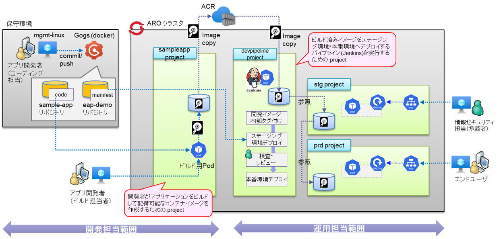

- デプロイ環境の準備
  - Insecureレジストリの設定
  - Jenkinsの展開
  - Gitリポジトリ(gogs)の展開
  - OpenShift内部レジストリ用blobへのアクセス許可
- デプロイ環境の設定
  - Jenkinsファイル兼マニフェスト用Gitリポジトリの作成
  - Jenkinsジョブ作成とJenkinsファイルの配置
  - OpenShiftプロジェクトの作成（検証/本番用プロジェクト）
  - OpenShift内部コンテナレジストリのIngress有効化
- イメージの作成
  - イメージビルド時の外部通信のためのFWルール設定
  - アプリケーションコード用Gitリポジトリの作成とアプリケーションコードの配置
  - OpenShift S2i機能の設定(templat更新）
  - OpenShift S2i機能によるイメージの作成
  - ACRへのイメージ移送
- アプリケーションの展開
  - サンプルアプリケーションで使用するデータベースの作成
  - ACRからOpenShiftの内部レジストリへのイメージ移送
  - マニフェストファイルの配置
  - Jenkinsジョブの実行
  - サンプルアプリケーションへのアクセス
- イメージの更新
  - サンプルアプリケーションコードの変更
  - s2iによる再ビルド(イメージ作成)
  - ACRへの更新イメージ移送
- アプリケーションver.2の展開
  - ACRからOpenShiftの内部レジストリへのイメージ移送
  - マニフェストファイルの配置
  - Jenkinsジョブの実行
  - サンプルアプリケーションへのアクセス

```bash
# 本セクションのコマンドは、実行端末の指定がない場合は、Linux保守端末で実行してください。

# Parameters for #6. アプリケーションの配置
NAME_PREFIX=azrefarc  # 「#0. 準備作業」の 「# Paramaters for #0」と同じ値を設定してください
RG_ARO=${NAME_PREFIX}-aro-rg
ARO_CLUSTER_NAME=${NAME_PREFIX}-aro
ARO_DOMAIN=aro4cluster.azrefarc-aro.net # 「#5. AROクラスタの作成」の 「# Paramaters for #5」と同じ値を設定してください
OCP_API_URL="CHANGEME"
DB_STG_NAME="${NAME_PREFIX}arodb-stg"
DB_PRD_NAME="${NAME_PREFIX}arodb-prd"
ACR_NAME="${NAME_PREFIX}aroacr"
MGMT_LINUX_VM_NAME=mgmt-linux-vm1
MGMT_LINUX_VM_NIC_NAME="${MGMT_LINUX_VM_NAME}-nic"

PROJECT_PREFIX=eap-demo
PROJECT_APP_NAME=${PROJECT_PREFIX}-dev
PROJECT_PIP_NAME=${PROJECT_PREFIX}-devpipline
PROJECT_STG_NAME=${PROJECT_PREFIX}-stg
PROJECT_PRD_NAME=${PROJECT_PREFIX}-prd
APP_WORKDIR=~/work/sample-app
EAPDEMO_WORKDIR=~/work/eap-demo
```

### 6-1. デプロイ環境の準備

#### 6-1-1. GitHubレポジトリのFork
https://github.com/yakiyoshi/eap-demo をFork

#### 6-1-2. Jenkinsの展開
- プロジェクトの作成
```bash
# admin01でopenshiftにログイン
oc login ${OCP_API_URL} --username=user01
# パイプライン用プロジェクトを作成
oc new-project ${PROJECT_PIP_NAME}
```

- Jenkinsの展開
```bash
# new-appでjenkinsをopenshiftに展開
oc new-app jenkins-persistent -p VOLUME_CAPACITY=20Gi

# Jenkinsの状態確認
# 出力例において、jenkins-1-md2sxがREADY:1/1であることを確認
# [md2sx]はランダムで環境毎に異なる
oc get pod
=== oc get pod 出力例 ===
NAME               READY   STATUS      RESTARTS   AGE
jenkins-1-deploy   0/1     Completed   0          7m27s
jenkins-1-md2sx    1/1     Running     0          7m22s

# Ingressの確認
# JenkinsのURLはHOST/PORT列(出力例では[jenkins-eap-demo-devpipline.apps.aro4cluster.azrefarc-aro.net])
oc get route
=== oc get route 出力例 ===
NAME      HOST/PORT                                                       PATH   SERVICES   PORT    TERMINATION     WILDCARD
jenkins   jenkins-eap-demo-devpipline.apps.aro4cluster.azrefarc-aro.net          jenkins    <all>   edge/Redirect   None
```
- Jenkinsにログイン

  - ブラウザを起動し、oc get routeのHOST/PORT列で確認したURLにアクセスする
    - 出力例においては、「https://jenkins-eap-demo-devpipline.apps.aro4cluster.azrefarc-aro.net」にアクセスする
  - [Log in with Openshift]をクリック

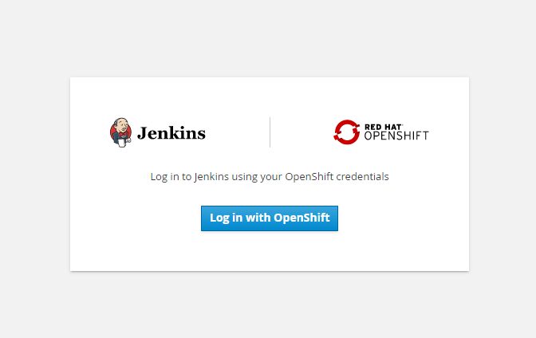
  - OpenShiftの認証画面に転送される。OpenShiftのユーザ/パスワード(admin01/p&ssw0rdp&ssw0rd)を入れてログイン

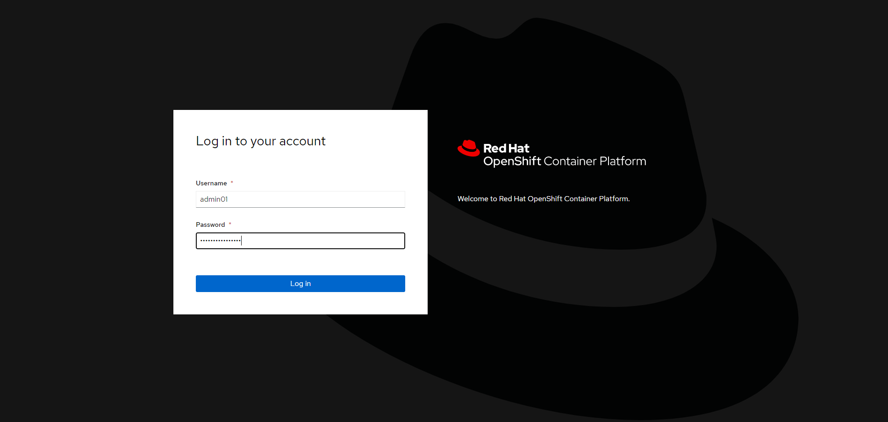
  - [Allow selected permissions]をクリック

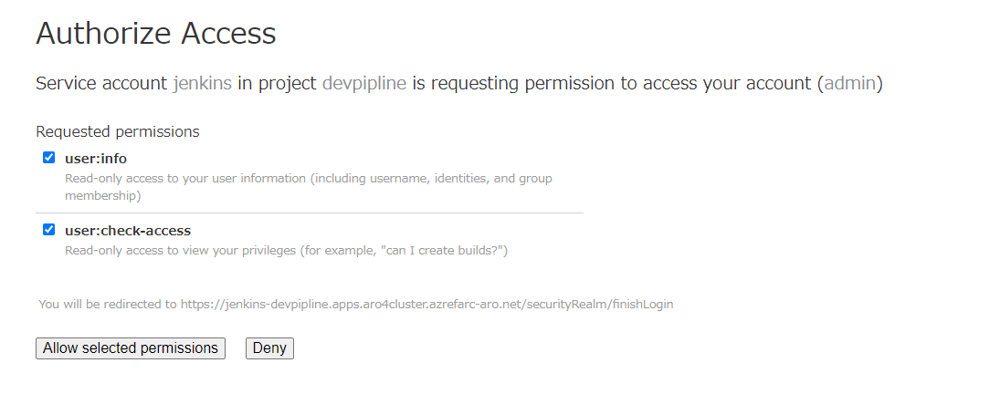
  - Jenkinsのトップページ

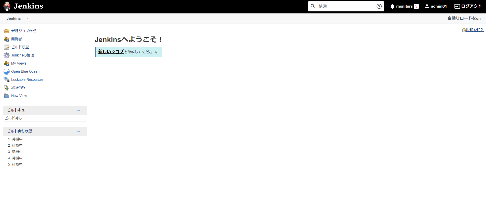

### 6-2. デプロイ環境の設定
#### 6-2-2. Jenkinsジョブ作成とJenkinsファイルの配置
- ブラウザを起動しJenkinsにログイン
  - [https://jenkins-eap-demo-devpipline.apps.aro4cluster.azrefarc-aro.net](https://jenkins-eap-demo-devpipline.apps.aro4cluster.azrefarc-aro.net)

- メイン画面の[新しいジョブ]をクリック


- [Enter an item name]にeap-demoと入力し、[パイプライン]を選択後、[OK]をクリック

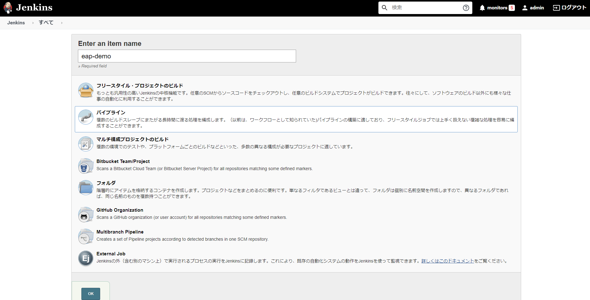
- [パイプライン]タブをクリック

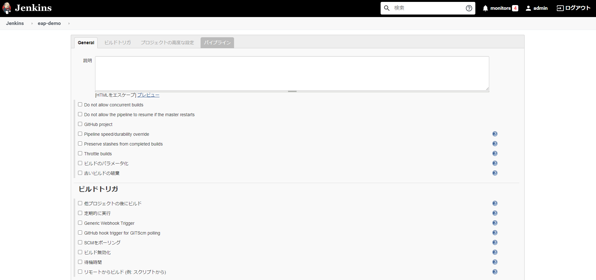
- 以下のパラメータを入力し[保存]をクリック
  - [リポジトリURL]はGitリポジトリのURL

  | パラメータ名 | 値 |
  |:-|:-|
  | 定義 | Pipline script from SCM |
  | SCM | Git |
  | リポジトリ - リポジトリURL | Fork先のURL |
 
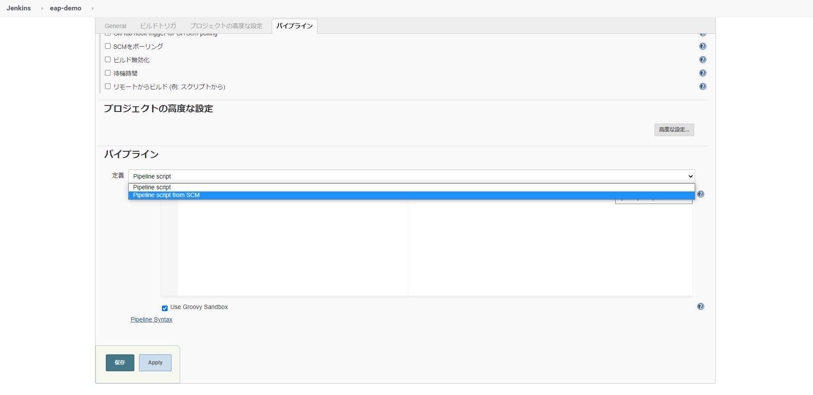

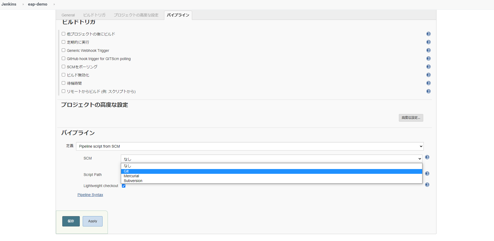

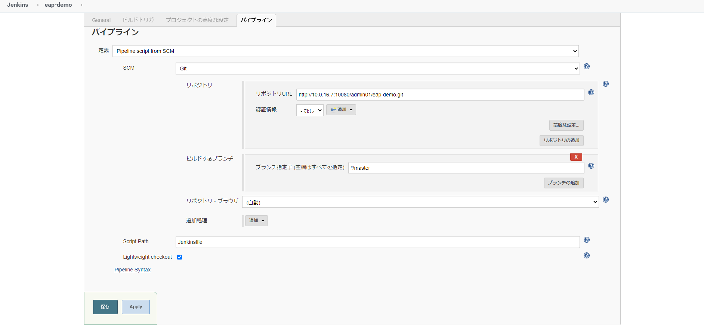

#### 6-2-3. OpenShiftプロジェクトの作成
- 検証用プロジェクトの作成
```bash
# 検証用プロジェクトの作成
oc new-project ${PROJECT_STG_NAME}

# jenkinsが検証用プロジェクト上のリソースを操作するための権限を付与
# Jenkinsで使用しているサービスアカウントに権限付与
oc adm policy add-role-to-user admin system:serviceaccount:${PROJECT_PIP_NAME}:jenkins --rolebinding-name=jenkins
```
- 本番用プロジェクトの作成
```bash
# 本番用プロジェクトの作成

oc new-project ${PROJECT_PRD_NAME}
# jenkinsが本番用プロジェクト上のリソースを操作するための権限を付与
# Jenkinsで使用しているサービスアカウントに権限付与
oc adm policy add-role-to-user admin system:serviceaccount:${PROJECT_PIP_NAME}:jenkins --rolebinding-name=jenkins
```

### 6-3. イメージの作成
アプリケーション開発部隊にて作成したイメージがACRに登録されたのち、運用部隊にてAROの環境にデプロイします。開発部隊は、各々の環境でアプリケーションを開発・テストし、最終的にリリースするコンテナイメージをACRに登録するところを担当します。

今回の環境は、上記のような開発部隊が使用する環境は構成しておらず、仮の環境としてAROに模擬開発環境としてプロジェクトを作成し、そのプロジェクト内でイメージを作成します。イメージの作成は、OpenShiftのs2i機能を利用してアプリケーションのソースコードからイメージを生成する方法で行います。

#### 6-3-3. s2i機能で利用するテンプレートリソースの更新
```bash
oc login ${OCP_API_URL} --username=admin
for resource in \
  eap73-amq-persistent-s2i.json \
  eap73-amq-s2i.json \
  eap73-basic-s2i.json \
  eap73-https-s2i.json \
  eap73-image-stream.json \
  eap73-sso-s2i.json \
  eap73-starter-s2i.json \
  eap73-third-party-db-s2i.json \
  eap73-tx-recovery-s2i.json
do
  oc replace --force -f \
https://raw.githubusercontent.com/jboss-container-images/jboss-eap-7-openshift-image/eap73/templates/${resource} -n openshift
done
```

#### 6-3-4. s2iでイメージの作成

```bash
# テナント管理者でログイン
oc login ${OCP_API_URL} --username=admin01

oc new-project ${PROJECT_APP_NAME}

# jenkinsが開発用プロジェクト上のリソースを操作するための権限を付与
# Jenkinsで使用しているサービスアカウントに権限付与
oc adm policy add-role-to-user admin system:serviceaccount:${PROJECT_PIP_NAME}:jenkins --rolebinding-name=jenkins

# サンプルアプリケーションで使うpostgresqlを展開
oc new-app --template=postgresql-persistent -p POSTGRESQL_USER=admin -p POSTGRESQL_PASSWORD="p&ssw0rdp&ssw0rd"

# postgresqlの起動状態確認
# 出力例ではpostgresql-1-cpz2lがREADY:1/1であることを確認
# [cpz2l]は環境毎に異なる
oc get pods
=== 出力例 ===
NAME                              READY   STATUS      RESTARTS   AGE
postgresql-1-cpz2l                1/1     Running     0          6h10m
postgresql-1-deploy               0/1     Completed   0          6h10m

# postgresqlにログインしてアプリケーション用にデータベースを作成
# [postgresql-1-cpz2l]は、前の手順で確認したPod名
oc rsh postgresql-1-cpz2l
sh-4.2$ psql -c "create database kitchensink"
sh-4.2$ exit

# s2iの実行
# SOURCE_REPOSITORY_URLは、サンプルアプリ用のGitレポジトリです。<Linux保守端末IP>は環境にあわせて適宜変更してください。
oc new-app --template=eap73-basic-s2i \
-p SOURCE_REPOSITORY_URL=https://github.com/yakiyoshi/jboss-eap-quickstarts.git \
-p SOURCE_REPOSITORY_REF=7.3.x-openshift \
-p CONTEXT_DIR="kitchensink" \
-e DB_SERVICE_PREFIX_MAPPING=kitchensink-postgresql=KITCHENSINK \
-e KITCHENSINK_POSTGRESQL_SERVICE_HOST=postgresql.eap-demo-dev.svc \
-e KITCHENSINK_POSTGRESQL_SERVICE_PORT=5432 \
-e KITCHENSINK_BACKGROUND_VALIDATION=true \
-e KITCHENSINK_DATABASE=kitchensink \
-e KITCHENSINK_USERNAME=admin \
-e KITCHENSINK_PASSWORD="p&ssw0rdp&ssw0rd" \
-e KITCHENSINK_JNDI=java:jboss/datasources/KitchensinkQuickstartDS

# サンプルアプリの起動状態確認
# 出力例において、eap-app-1-8x2mzがREADY:1/1であることを確認
# [8x2mz]は環境毎に異なる
oc get pod
=== 出力例 ===
NAME                              READY   STATUS      RESTARTS   AGE
eap-app-1-8x2mz                   1/1     Running     0          10m
eap-app-1-deploy                  0/1     Completed   0          10m
eap-app-2-build                   0/1     Completed   0          13m
eap-app-build-artifacts-1-build   0/1     Completed   0          17m
postgresql-1-cpz2l                1/1     Running     0          171m
postgresql-1-deploy               0/1     Completed   0          172m
```

### 6-4. アプリケーションの展開
#### 6-4-1. データベースの作成
```bash
psql -h ${DB_STG_NAME}.privatelink.postgres.database.azure.com -Uazrefadmin@${DB_STG_NAME} -d postgres -c "create database kitchensink"
psql -h ${DB_PRD_NAME}.privatelink.postgres.database.azure.com -Uazrefadmin@${DB_PRD_NAME} -d postgres -c "create database kitchensink"
```

#### 6-4-3. マニフェストファイルの変更
```bash
cd ${EAPDEMO_WORKDIR}

# データベース設定の変更
sed -i "s/CHANGE_ME_DATABASE_NAME/${DB_STG_NAME}/" stg/deployment.yaml
sed -i "s/CHANGE_ME_DATABASE_NAME/${DB_PRD_NAME}/" prd/deployment.yaml

git add -A
git commit -a -m "Updated manifest"
git push
```

#### 6-4-4. jenkinsジョブの実行
- Jenkinsにログイン
- ジョブを選択(eap-demo)

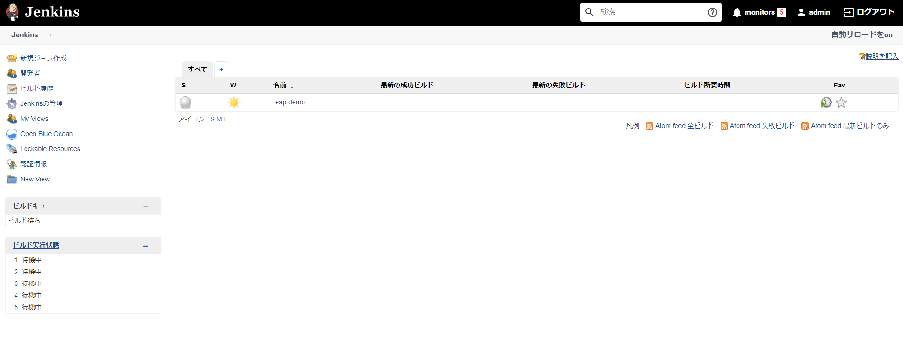
- [ビルドの実行]をクリック。gogsに配置したJenkinsFileが読み込まれpipelineが構成される。イメージtagがデフォルトのlatestで実行されるため、最初のビルドは失敗する。
  - 本来は[パラメータ付きのビルド]を指定してイメージtagを"v1"に設定する手順だが、初期状態ではJenkinsfileが読み込まれておらず[パラメータ付きのビルド]を選択できないため、この挙動となる。このエラーは無視して問題ない。

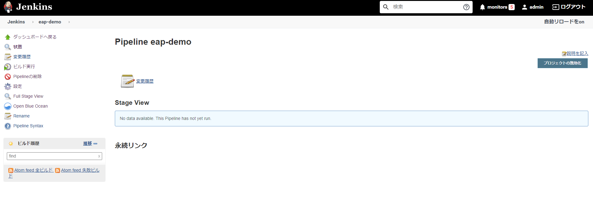
- ページを更新すると、[ビルド実行]が[パラメータ付きのビルド]に更新される。[パラメータ付きのビルド]をクリック

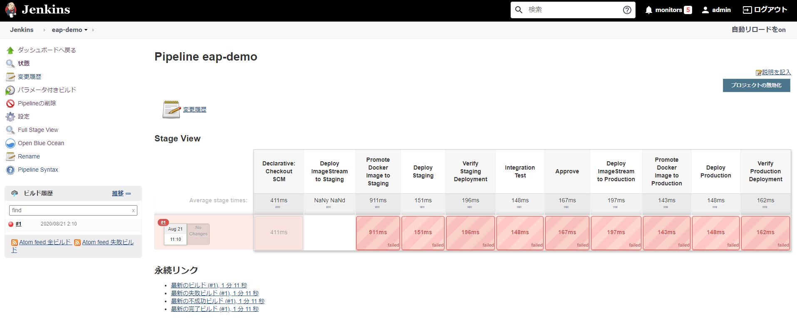
- [tag]に[v1]と入力し[ビルド]をクリック

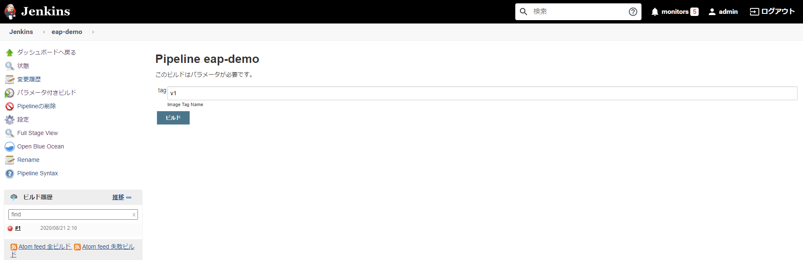
- 検証環境(stg projct)にアプリケーションが展開されると、Approveで入力待ちになる。検証環境での確認を終えたのち、本番環境(prd project)への展開の承認を行う。停止中のアイテムの上にカーソルを移動すると承認ウィンドウが表示されるので[承認者]欄に名前を入力し[Procced]をクリック

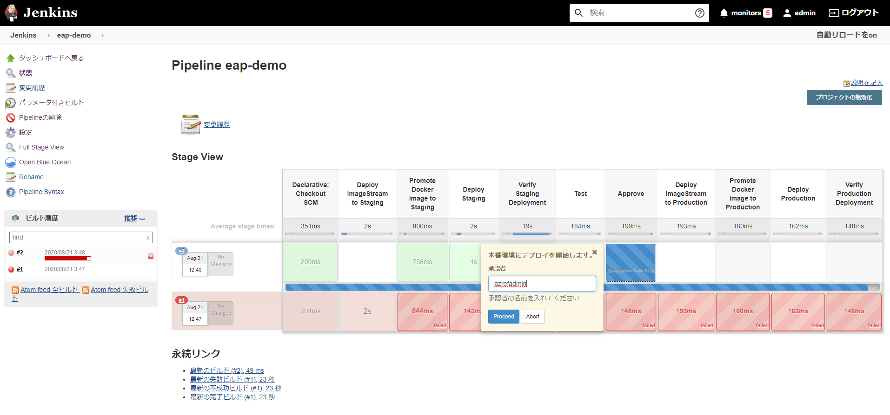
- Piplineが流れ、本番環境にアプリケーションが展開される。アイテムがすべてグリーンであることを確認

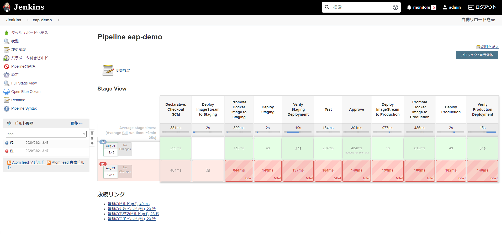

#### 6-4-5. サンプルアプリケーションへのアクセス
- 以下のコマンドを実行しサンプルアプリケーションのURLを確認
```bash
oc get route -n ${PROJECT_PRD_NAME}
=== 出力例 ===
NAME      HOST/PORT                                                PATH   SERVICES   PORT    TERMINATION     WILDCARD
eap-app   eap-app-eap-demo-prd.apps.aro4cluster.azrefarc-aro.net          eap-app    <all>   edge/Redirect   None
```

- ブラウザを起動しサンプルアプリケーションにアクセス
  - https://eap-app-eap-demo-prd.apps.aro4cluster.azrefarc-aro.net


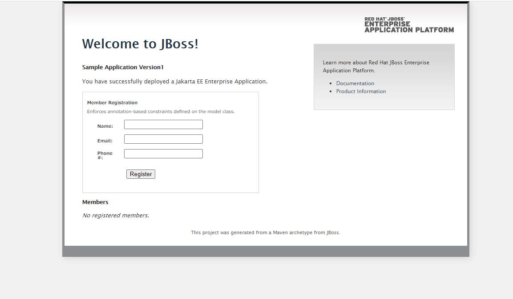

- パラメータを入力し[Register]をクリック

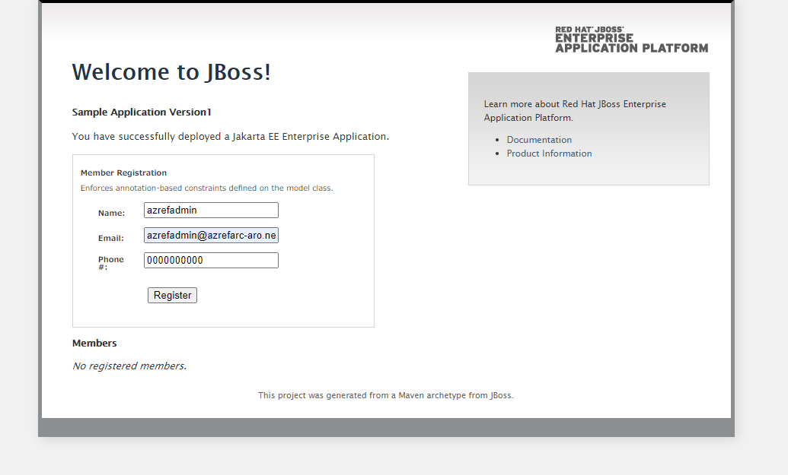

- [Members]に表示されていることを確認

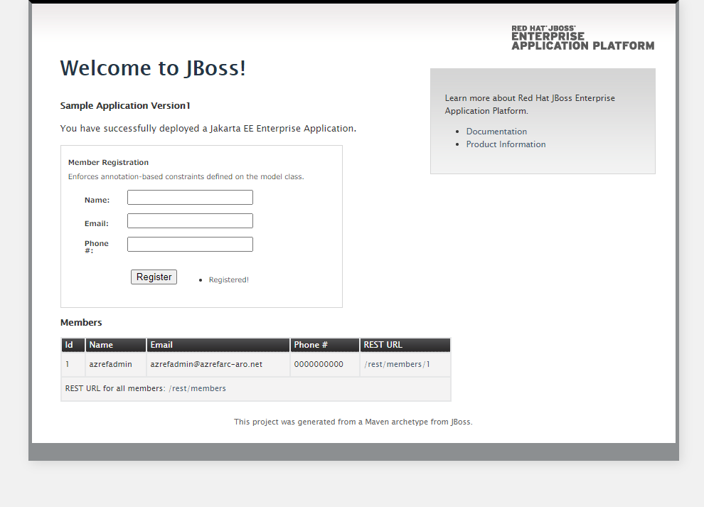

- 現時点では、[Sample Application Version1]と表示されていることを確認。次のイメージの更新において、[Sample Application Version2]となるような変更を加える

### 6-5. イメージの更新
- サンプルアプリケーションコードの変更
```bash
cd ${APP_WORKDIR}

sed -i "s/Version1/Version2/" src/main/webapp/index.xhtml
git commit -a -m "Updated v2"
git push
```

- s2iによる再ビルド(イメージ作成)
```bash
oc login ${OCP_API_URL} -u admin01
oc project ${PROJECT_APP_NAME}
oc start-build buildconfig.build.openshift.io/eap-app-build-artifacts

# サンプルアプリの起動状態確認
# もともと起動していたeap-app-1-8x2mzが削除されている
# 新しくeap-app-2-6krkgが起動し、READY:1/1であることを確認
# [6krkg]は環境毎に異なる
oc get pod
=== 出力例 ===
NAME                                  READY   STATUS      RESTARTS   AGE
eap-app-1-deploy                  0/1     Completed   0          45m
eap-app-2-6krkg                   1/1     Running     0          89s
eap-app-2-build                   0/1     Completed   0          47m
eap-app-2-deploy                  0/1     Completed   0          97s
eap-app-3-build                   0/1     Completed   0          4m2s
eap-app-build-artifacts-1-build   0/1     Completed   0          52m
eap-app-build-artifacts-2-build   0/1     Completed   0          7m24s
postgresql-1-cpz2l                1/1     Running     0          3h26m
postgresql-1-deploy               0/1     Completed   0          3h26m
```

- ACRへの更新イメージ移送
```bash
az acr login --name ${ACR_NAME}
oc login ${OCP_API_URL} -u admin01
docker login default-route-openshift-image-registry.apps.${ARO_DOMAIN} -u $(oc whoami) -p $(oc whoami -t)

docker pull default-route-openshift-image-registry.apps.${ARO_DOMAIN}/eap-demo-dev/eap-app:latest
docker tag default-route-openshift-image-registry.apps.${ARO_DOMAIN}/eap-demo-dev/eap-app:latest ${ACR_NAME}.azurecr.io/eap-demo/eap-app:v2
docker push ${ACR_NAME}.azurecr.io/eap-demo/eap-app:v2
```

### 6-6.　アプリケーションver.2の展開
#### 6-6-1. コンテナイメージの移送(ACR->内部レジストリ)
```bash
az acr login --name ${ACR_NAME}
oc login ${OCP_API_URL} -u admin01
docker login default-route-openshift-image-registry.apps.${ARO_DOMAIN} -u $(oc whoami) -p $(oc whoami -t)

# v2のタグでパイプライン用プロジェクトのレジストリにイメージをコピー
docker pull ${ACR_NAME}.azurecr.io/eap-demo/eap-app:v2
docker tag ${ACR_NAME}.azurecr.io/eap-demo/eap-app:v2 default-route-openshift-image-registry.apps.${ARO_DOMAIN}/eap-demo-devpipline/eap-app:v2
docker push default-route-openshift-image-registry.apps.${ARO_DOMAIN}/eap-demo-devpipline/eap-app:v2


# イメージスキャンを行う場合、default-route-openshift-image-registry.apps.aro4cluster.azrefarc-aro.net/eap-demo-devpipline/eap-app:v2に対して実施
```

#### 6-6-2. マニフェストの更新
```bash
cd ${EAPDEMO_WORKDIR}
sed -i "s/v1-stg/v2-stg/" stg/deployment.yaml
sed -i "s/v1-prd/v2-prd/" prd/deployment.yaml
git commit -a -m "Updated v2"
git push
```

#### 6-6-3. jenkinsの実行
- Jenkinsにログイン
- ジョブを選択(eap-demo)

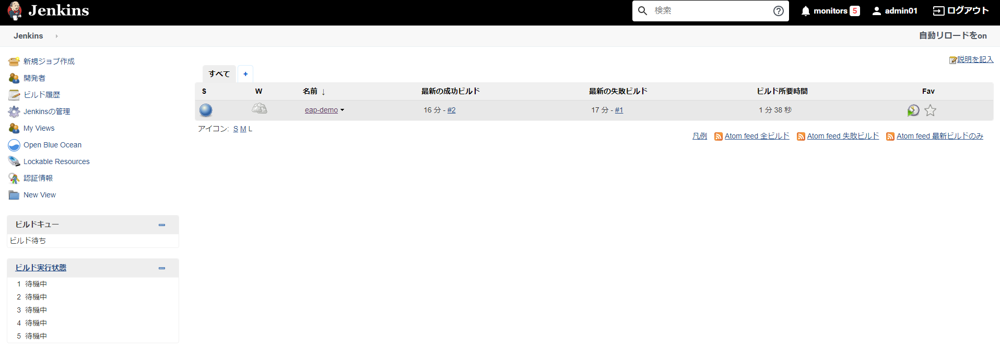
- [パラメータ付きのビルド]をクリック

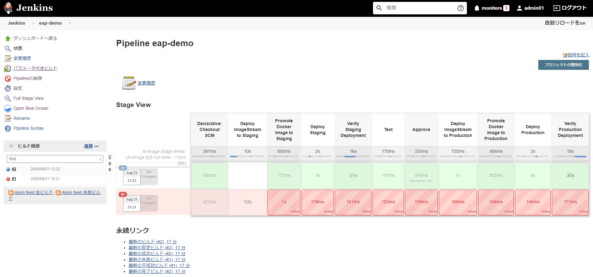
- [tag]に[v2]と入力し[ビルド]をクリック

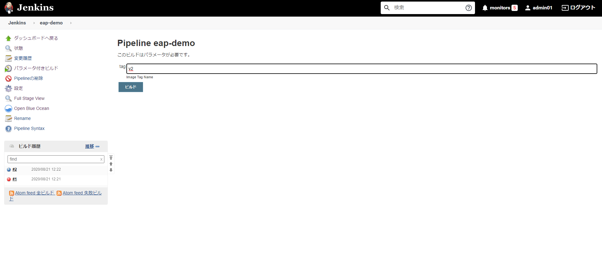
- Approveで入力待ちになる。停止中のアイテムの上にカーソルを移動すると承認ウィンドウが表示されるので[承認者]欄に名前を入力し、[Procced]をクリック

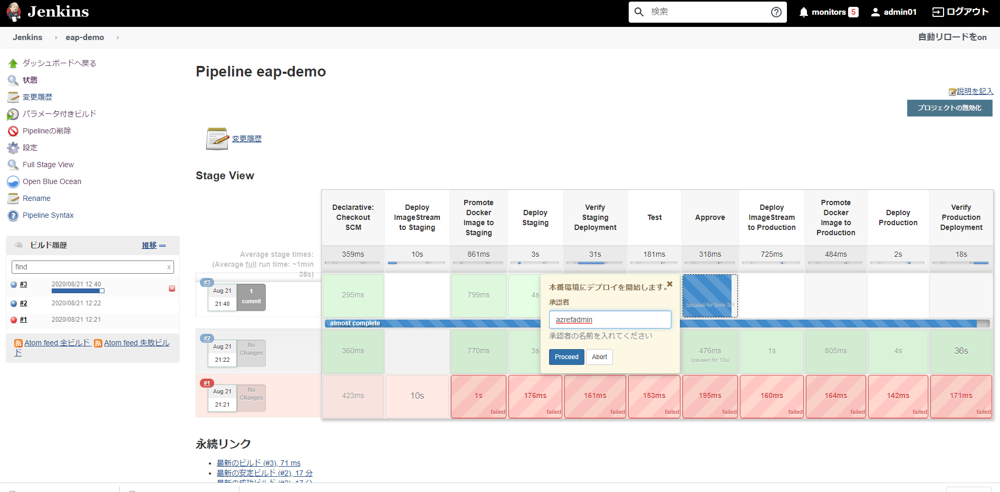
- Piplineが最後まで流れ、アイテムがすべてグリーンであることを確認

#### 6-6-4. サンプルアプリケーションにアクセス
- ブラウザでサンプルアプリケーションにアクセス
  - https://eap-app-eap-demo-prd.apps.aro4cluster.azrefarc-aro.net

- [Sample Application Version2]の表示を確認

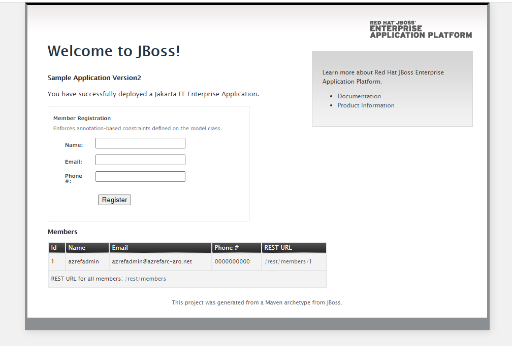
